# 实验一：环境配置及 PyTorch 练习

## 任务一：环境配置

### 一、安装 VsCode

```
sudo snap install --classic code
```

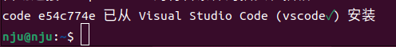

### 二、安装 Docker

1. 安装 Docker 官方版本

添加镜像源：

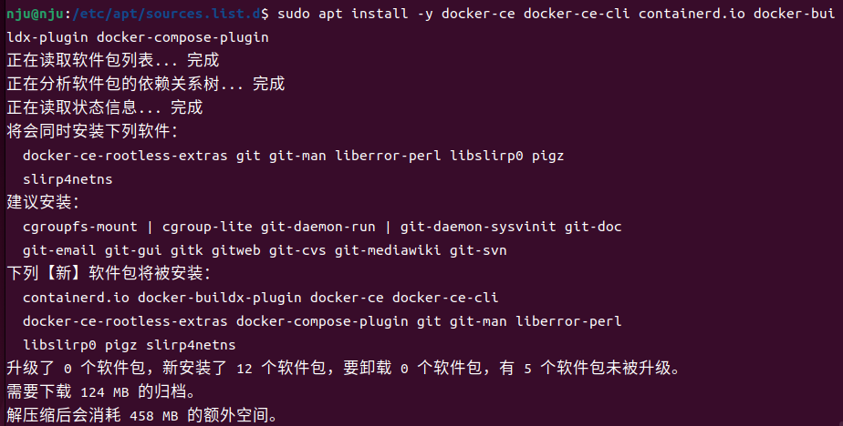

2. 配置用户权限：

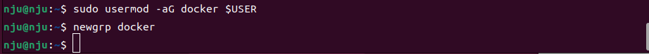

3. 配置镜像源及 NVIDIA 容器工具包

安装 NVIDIA 容器工具包：

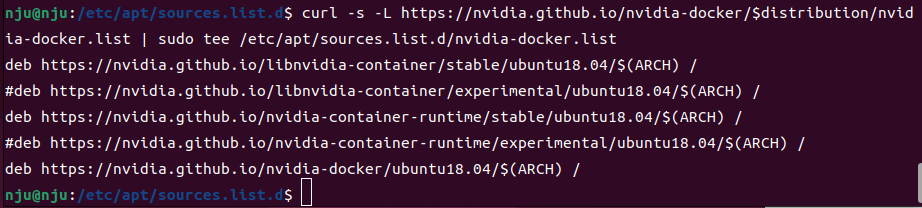
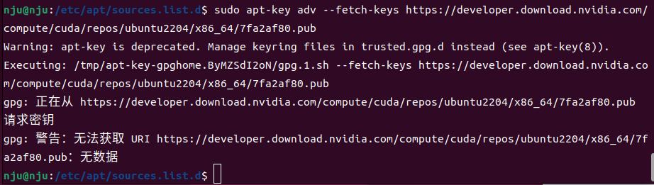
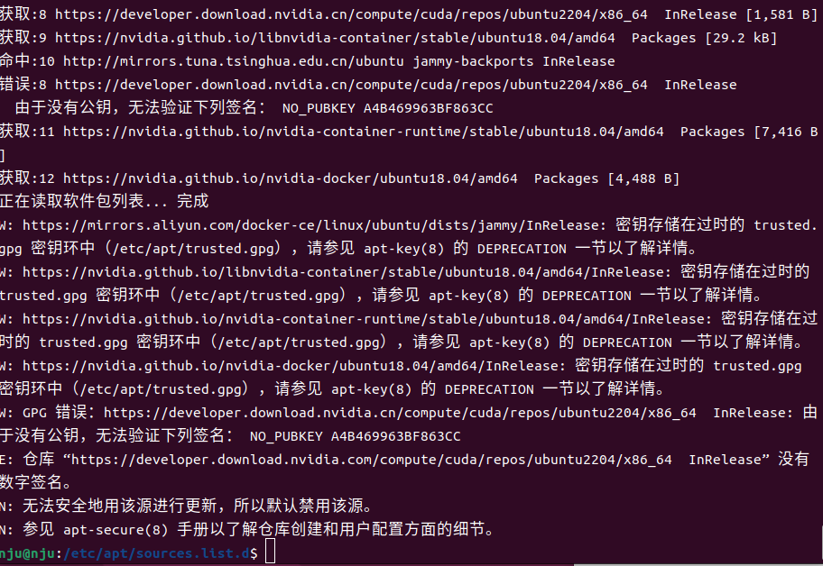
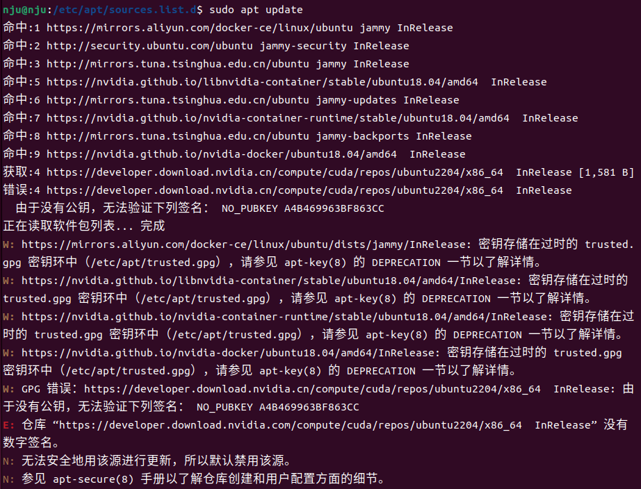
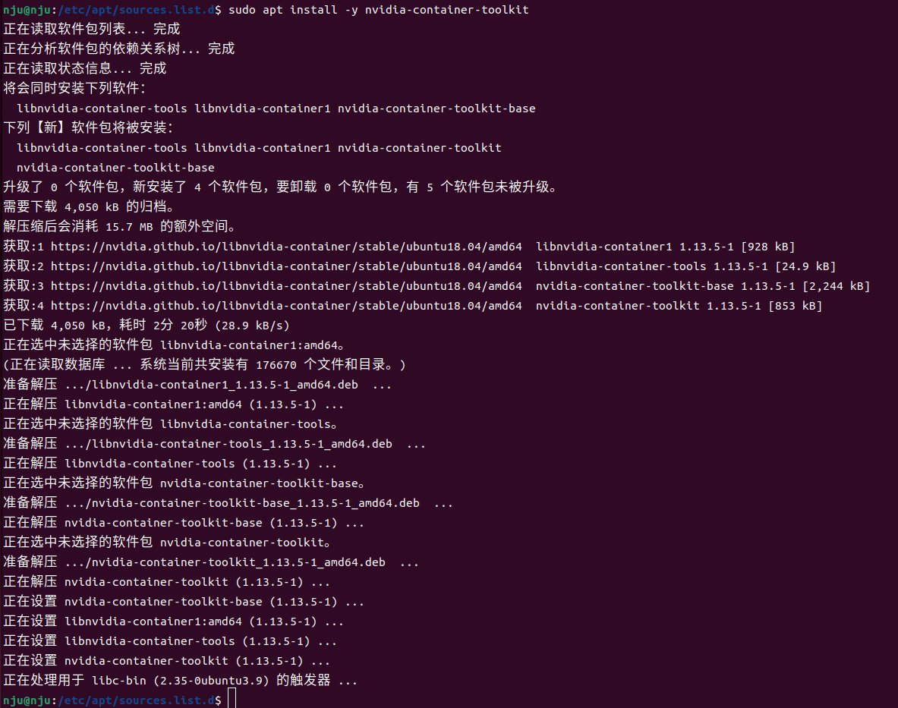

4. 验证安装

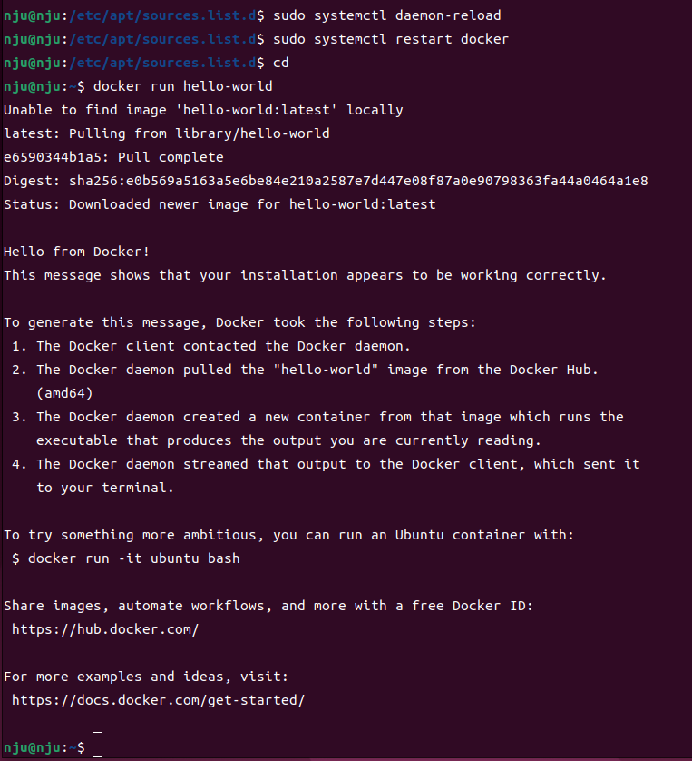

### 三、配置 VSCode 使用 Docker

1. 安装 Docker 扩展
2. 创建并运行基础容器

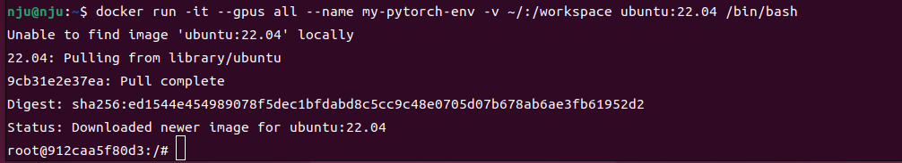

3. 连接容器

```
docker start my-pytorch-env
```

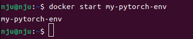

### 四、Docker 容器内配置 Conda 和 PyTorch

1.安装 Miniconda

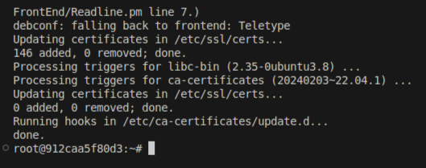
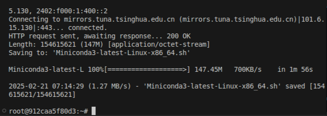
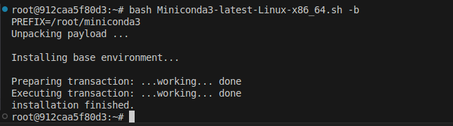
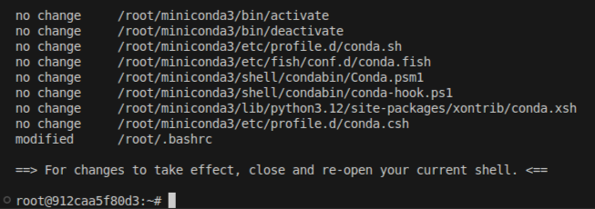

2.创建 PyTorch 环境

添加镜像源：

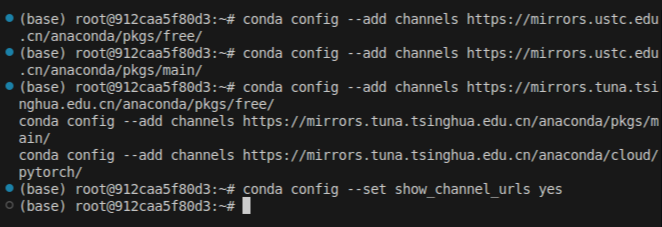

创建并配置环境：

```
conda activate pytorch
```

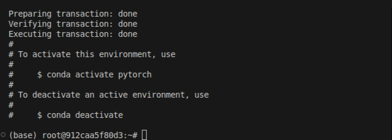

安装 pytorch 及实验所需依赖：

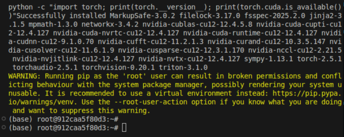

3.验证 PyTorch

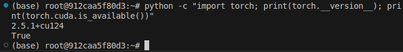

## 任务二：PyTorch 练习

### 一、启动环境

连接到 WSL：

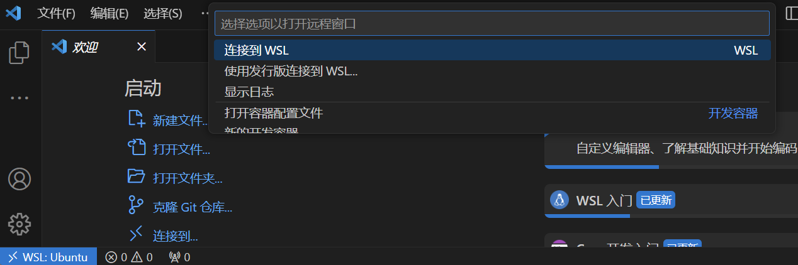

启动 docker 容器：

```
docker start my-pytorch-env
```

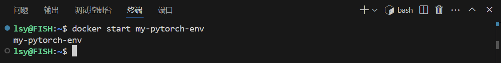

附加到正在运行的容器：

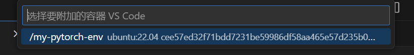

切换环境：

```
conda activate pytorch
```

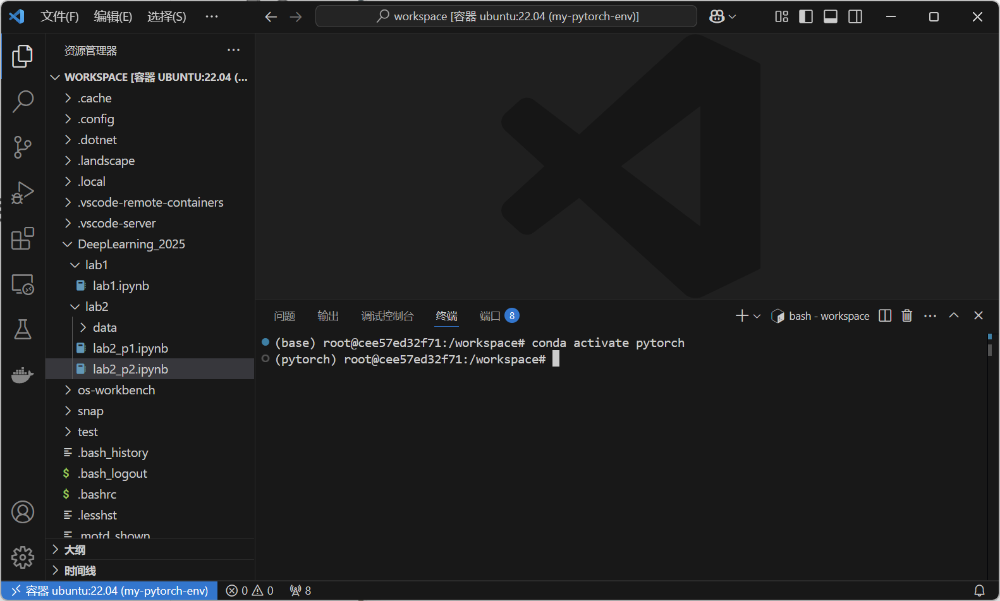

### 二、补全代码

部分代码：（完整见 Jupyter Notebook 文件）

```python
for epoch in range(num_epochs):
    for X, y in data_iter:
        #TODO:计算损失
        l = loss(net(X), y)
        #TODO:清空梯度
        trainer.zero_grad()
        #TODO:反向传播
        l.backward()
        #TODO:优化器更新参数
        trainer.step()

    l = loss(net(features), labels)
    print(f'epoch {epoch + 1}, loss {l:f}')
```

运行结果：

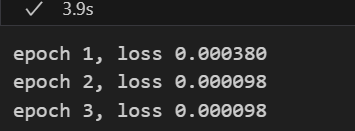

## 实验心得与体会

本次实验让我对深度学习的开发环境搭建及 PyTorch 基础操作有了更直观的理解。

在环境配置过程中，我学会了安装 VSCode、Docker、conda 以及 PyTorch 环境，并学会使用 Jupyter Notebook 进行代码编写和测试。

在 PyTorch 练习中，我掌握了张量操作、自动求导机制、模型构建与训练等基本功能，加深了对 PyTorch 计算图的理解，并熟悉了其灵活的神经网络搭建方式。

总体而言，本次实验不仅让我掌握了深度学习环境的搭建方法，也让我对 PyTorch 的基本用法有了更扎实的认知，为后续的深度学习任务奠定了基础。

# 实验二：神经网络基础：激活函数与正则化

## 任务一：MINIST 手写数字识别

##### 思考：如果不打乱训练集，会对训练结果产生什么影响？

如果数据是按序排列的，模型可能会记住这种顺序，而不是学习到数据的通用特征，导致模型在训练集上的表现很好，但在测试集或其他未见过的数据上表现较差，即过拟合。

## 任务二：正则化和激活函数探索

##### 思考题 1：为什么神经网络需要非线性激活函数？如果使用线性激活函数会发生什么？

非线性激活函数能够使神经网络学习复杂的、非线性的数据模式。现实世界的问题往往是复杂的，对应地需要非线性激活函数。若使用线性激活函数可能导致梯度消失或梯度爆炸问题，影响神经网络的训练效率和稳定性。

##### 思考题 2：观察实验结果，为什么训练准确率会和激活函数选择相关？这与梯度分布有什么关系？

激活函数影响训练准确率，主要与梯度分布相关。

- **ReLU** 仅在负区间梯度为 0，避免梯度消失，训练效果好（最终 68.40%）。
- **Sigmoid** 梯度容易趋近 0，导致梯度消失，训练停滞（11.24%）。
- **Tanh** 梯度范围较大，收敛较快，但仍可能梯度消失（最终 81.82%）。
  ReLU 更受欢迎，因其计算简单、能缓解梯度消失、适用于深度学习。

##### 思考题 3：ReLU 死亡现象的成因是什么？有哪些解决方案？

ReLU 死亡现象是由于输入长期小于 0，梯度为 0，神经元不再更新，常由不当初始化、学习率过高、梯度消失导致。

解决方案：

1. **Leaky ReLU / PReLU / ELU**：在负区间保留小梯度，避免完全死亡。
2. **He 初始化**：调整初始权重，减少神经元进入负区间的概率。
3. **降低学习率**：防止权重更新幅度过大，减少神经元失活。

##### 思考题 4：使用 L2 正则化后，模型的参数会发生什么变化？为什么这种变化有助于防止过拟合？

L2 正则化使权重变小、更均匀，减少模型复杂度。

防止过拟合的原因：

1. **限制权重大小**，减少对特定样本的过度依赖。
2. **平滑决策边界**，降低对噪声的敏感性。
3. **控制复杂度**，提高泛化能力，避免高方差。

##### 思考题 5：Dropout 为什么能够起到正则化的作用？训练时和测试时的差异处理有什么意义？

Dropout 正则化作用：

1. 相当于训练多个子模型，提升泛化能力（集成学习思想）。
2. 减少特征依赖，防止神经元过度适应特定模式。

差异处理的意义：

- 训练时随机丢弃神经元，降低过拟合。
- 测试时缩放权重，保持激活值分布稳定。

## 实验心得与体会

本次实验让我深入理解了神经网络的训练、激活函数的选择及正则化方法的作用。

在 MNIST 任务中，MLP 通过 ReLU 激活和优化器训练，表现远超感知机，体现了深度学习的优势。激活函数实验说明 ReLU 具备快速收敛能力，但存在死亡问题，可用 Leaky ReLU 解决。

正则化实验显示 L2 正则化能减少过拟合，Dropout 通过随机丢弃神经元提高泛化能力。

整体而言，本次实验加深了我对深度学习模型优化与泛化能力提升的理解。
