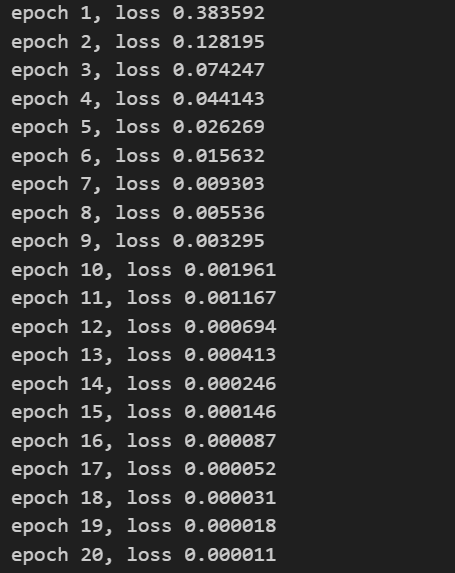
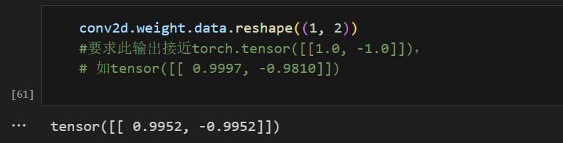
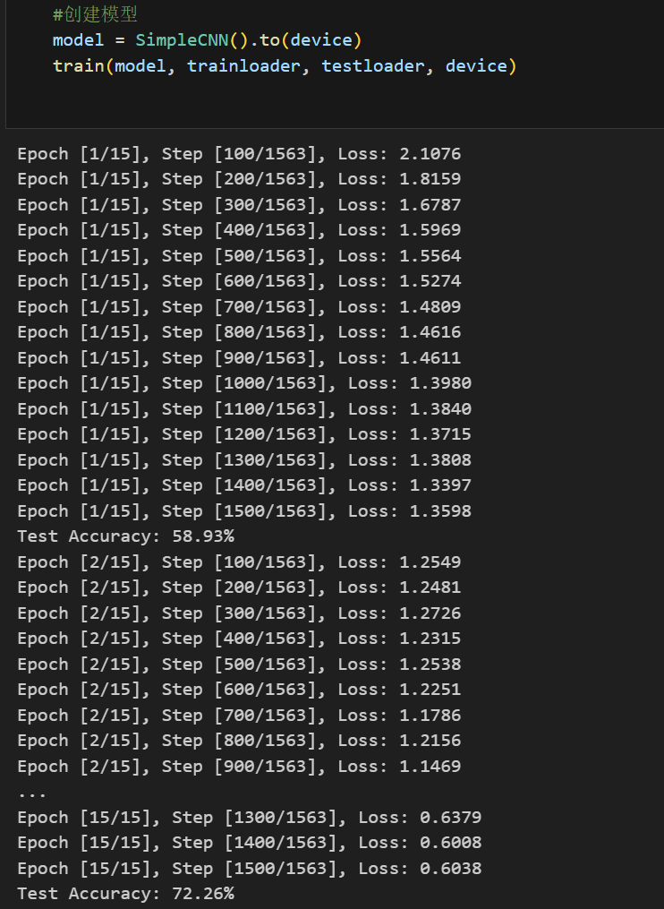
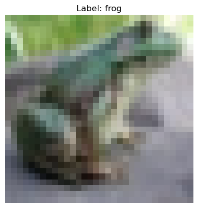
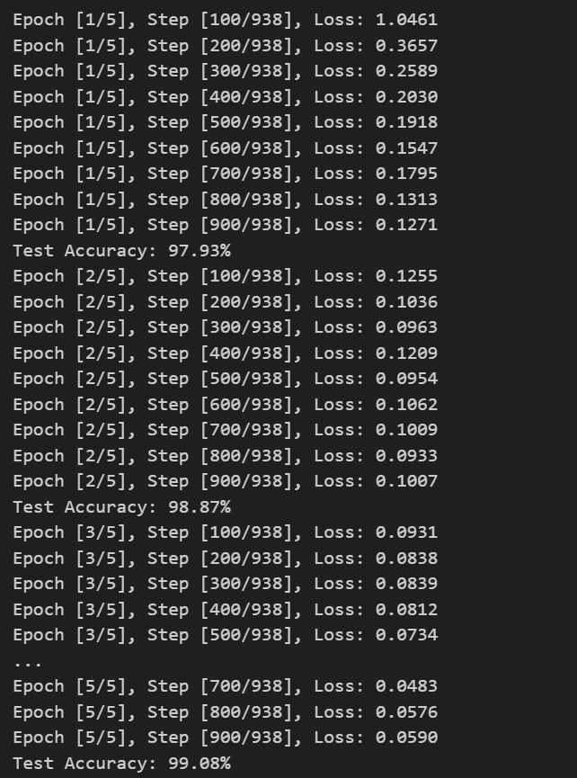
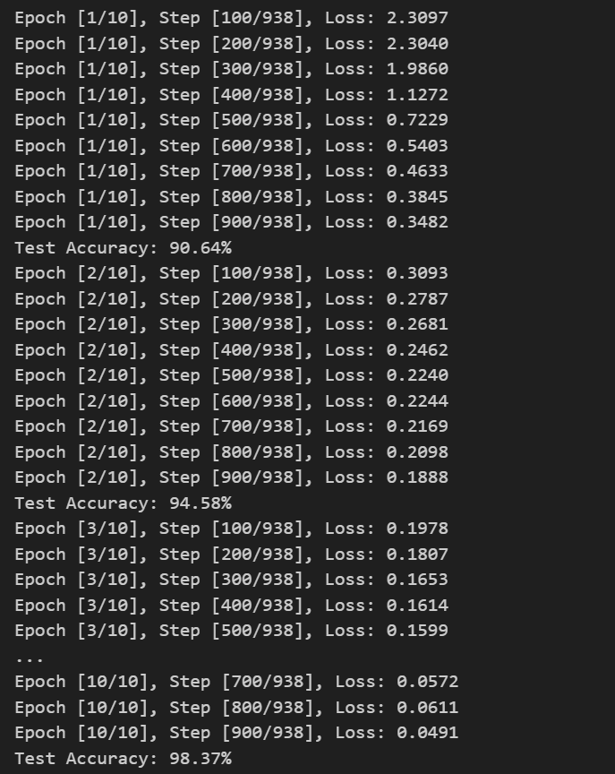
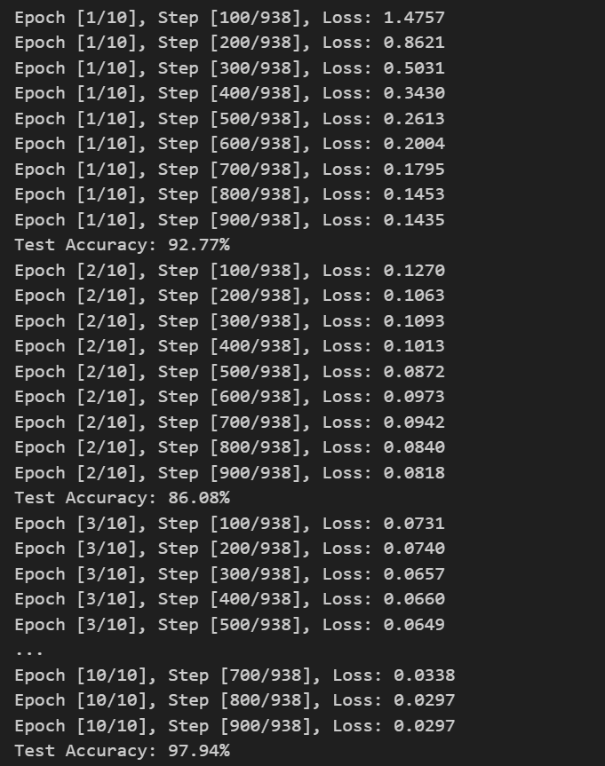

# 实验三 CNN 网络实现

## 任务一：图像卷积

### 练习 图像中目标的边缘检测

补全训练过程代码：

```python
#训练补全部分(自定义损失函数，训练epoch，学习率等)
#TODO
lr = 0.8 # 学习率
num_epochs = 20
loss = nn.MSELoss()
trainer = torch.optim.SGD(conv2d.parameters(), lr=lr)

for epoch in range(num_epochs):
    Y_hat = conv2d(X)
    l = loss(Y_hat, Y)
    trainer.zero_grad()
    l.backward()
    trainer.step()

    print(f'epoch {epoch + 1}, loss {l:f}')
```

训练结果：



输出结果：



## 任务二：CNN 图像分类

### 1. CNN 图像分类任务

本次任务要求补全代码中空缺部分，包括实现一个 CNN 类，以及训练过程代码

定义 CNN 网络：

```python
class SimpleCNN(nn.Module):
    def __init__(self):
        super(SimpleCNN, self).__init__()
        #TODO: 实现模型结构
        #TODO 实现self.conv1:卷积层
        self.conv1 = nn.Conv2d(in_channels=3, out_channels=32, kernel_size=3, padding=1)
        #TODO 实现self.conv2:卷积层
        self.conv2 = nn.Conv2d(in_channels=32, out_channels=64, kernel_size=3, padding=1)
        #TODO 实现self.pool: MaxPool2d
        self.pool = nn.MaxPool2d(kernel_size=2, stride=2)
        #TODO 实现self.fc1: 线性层
        self.fc1 = nn.Linear(64 * 8 * 8, 128)
        #TODO 实现self.fc2：线性层
        self.fc2 = nn.Linear(128, 10)
        #TODO 实现 self.dropout: Dropout层
        self.dropout = nn.Dropout(p=0.5)

    def forward(self, x):
        x = self.pool(F.relu(self.conv1(x)))
        x = self.pool(F.relu(self.conv2(x)))
        x = x.view(-1, 64 * 8 * 8)
        x = F.relu(self.fc1(x))
        x = self.dropout(x)
        x = self.fc2(x)

        return x
```

训练过程补全：

```python
def train(model, train_loader, test_loader, device):
    num_epochs = 15
    criterion = nn.CrossEntropyLoss()
    optimizer = optim.Adam(model.parameters(), lr=0.001)

    for epoch in range(num_epochs):
        model.train()
        running_loss = 0.0
        for i, (inputs, labels) in enumerate(train_loader):
            inputs, labels = inputs.to(device), labels.to(device)
            #TODO:实现训练部分，完成反向传播过程
            #TODO: optimizer梯度清除
            optimizer.zero_grad()
            #TODO: 模型输入
            outputs = model(inputs)
            #TODO: 计算损失
            loss = criterion(outputs, labels)
            #TODO: 反向传播
            loss.backward()
            #TODO: 更新参数
            optimizer.step()

            running_loss += loss.item()
            if i % 100 == 99:  # 每100个batch打印一次损失
                print(
                    f'Epoch [{epoch + 1}/{num_epochs}], Step [{i + 1}/{len(train_loader)}], Loss: {running_loss / 100:.4f}')
                running_loss = 0.0

        # 每个epoch结束后在测试集上评估模型
        model.eval()
        correct = 0
        total = 0
        with torch.no_grad():
            for inputs, labels in test_loader:
                inputs, labels = inputs.to(device), labels.to(device)
                outputs = model(inputs)
                _, predicted = torch.max(outputs.data, 1)
                total += labels.size(0)
                correct += (predicted == labels).sum().item()

        print(f'Test Accuracy: {100 * correct / total:.2f}%')
```

训练结果：




### 2. 在 MNIST 数据集上实现 CNN

在实验二中我们实现了在 MNIST 数据集上进行分类， 使用本节的 CNN 又该如何实现，结合本节内容以及实验二内容尝试实现

代码：

```python
import torch
import torchvision.transforms as transforms
import torch.nn as nn
import torch.optim as optim
import torch.nn.functional as F

trainset = datasets.MNIST(root='./data', train=True, download=True, transform=transforms.ToTensor())
testset = datasets.MNIST(root='./data', train=False, download=True, transform=transforms.ToTensor())
trainloader = torch.utils.data.DataLoader(trainset, batch_size=64, shuffle=True)
testloader = torch.utils.data.DataLoader(testset, batch_size=64, shuffle=False)

class MNIST_CNN(nn.Module):
    def __init__(self):
        super(MNIST_CNN, self).__init__()
        self.conv1 = nn.Conv2d(in_channels=1, out_channels=32, kernel_size=3, padding=1)  # MNIST只有1个通道
        self.conv2 = nn.Conv2d(in_channels=32, out_channels=64, kernel_size=3, padding=1)
        self.pool = nn.MaxPool2d(kernel_size=2, stride=2)
        self.fc1 = nn.Linear(64 * 7 * 7, 128)  # MNIST 图像大小从 28x28 缩小到 7x7
        self.fc2 = nn.Linear(128, 10)
        self.dropout = nn.Dropout(p=0.5)

    def forward(self, x):
        x = self.pool(F.relu(self.conv1(x)))
        x = self.pool(F.relu(self.conv2(x)))
        x = x.view(-1, 64 * 7 * 7)
        x = F.relu(self.fc1(x))
        x = self.dropout(x)
        x = self.fc2(x)
        return x

# 训练函数（与 CIFAR-10 训练过程相同）
def train(model, train_loader, test_loader, device):
    num_epochs = 5 # 前几步就有很高准确率故下调
    criterion = nn.CrossEntropyLoss()
    optimizer = optim.Adam(model.parameters(), lr=0.001)

    for epoch in range(num_epochs):
        model.train()
        running_loss = 0.0
        for i, (inputs, labels) in enumerate(train_loader):
            inputs, labels = inputs.to(device), labels.to(device)

            optimizer.zero_grad()
            outputs = model(inputs)
            loss = criterion(outputs, labels)
            loss.backward()
            optimizer.step()

            running_loss += loss.item()
            if i % 100 == 99:
                print(f'Epoch [{epoch + 1}/{num_epochs}], Step [{i + 1}/{len(train_loader)}], Loss: {running_loss / 100:.4f}')
                running_loss = 0.0

        # 每个epoch结束后在测试集上评估模型
        model.eval()
        correct = 0
        total = 0
        with torch.no_grad():
            for inputs, labels in test_loader:
                inputs, labels = inputs.to(device), labels.to(device)
                outputs = model(inputs)
                _, predicted = torch.max(outputs.data, 1)
                total += labels.size(0)
                correct += (predicted == labels).sum().item()

        print(f'Test Accuracy: {100 * correct / total:.2f}%')

device = torch.device("cuda" if torch.cuda.is_available() else "cpu")
model = MNIST_CNN().to(device)
train(model, trainloader, testloader, device)
```

训练结果：



### 3. 卷积神经网络（LeNet）

将前文给出的 net 结构以类的方式实现，并实现在 MNIST 数据集上的分类

代码：

```python
import torch
import torchvision.transforms as transforms
import torch.nn as nn
import torch.optim as optim
import torch.nn.functional as F

trainset = datasets.MNIST(root='./data', train=True, download=True, transform=transforms.ToTensor())
testset = datasets.MNIST(root='./data', train=False, download=True, transform=transforms.ToTensor())
trainloader = torch.utils.data.DataLoader(trainset, batch_size=64, shuffle=True)
testloader = torch.utils.data.DataLoader(testset, batch_size=64, shuffle=False)

class LeNet(nn.Module):
    def __init__(self):
        super(LeNet, self).__init__()
        self.conv1 = nn.Conv2d(1, 6, kernel_size=5, padding=2)  # 输入 1 通道，输出 6 通道
        self.conv2 = nn.Conv2d(6, 16, kernel_size=5)  # 输入 6 通道，输出 16 通道
        self.pool = nn.AvgPool2d(kernel_size=2, stride=2)  # 平均池化层
        self.fc1 = nn.Linear(16 * 5 * 5, 120)  # 16 个 5x5 特征图展平后连接到 120 维
        self.fc2 = nn.Linear(120, 84)  # 120 -> 84
        self.fc3 = nn.Linear(84, 10)  # 84 -> 10 (分类数)

    def forward(self, x):
        x = self.pool(F.sigmoid(self.conv1(x)))  # 卷积 + 激活 + 池化
        x = self.pool(F.sigmoid(self.conv2(x)))  # 卷积 + 激活 + 池化
        x = x.view(-1, 16 * 5 * 5)  # 展平
        x = F.sigmoid(self.fc1(x))  # 全连接 + 激活
        x = F.sigmoid(self.fc2(x))  # 全连接 + 激活
        x = self.fc3(x)  # 最后全连接
        return x

# 训练函数
def train(model, train_loader, test_loader, device):
    num_epochs = 10  # 训练 10 轮
    criterion = nn.CrossEntropyLoss()
    optimizer = optim.Adam(model.parameters(), lr=0.001)

    for epoch in range(num_epochs):
        model.train()
        running_loss = 0.0
        for i, (inputs, labels) in enumerate(train_loader):
            inputs, labels = inputs.to(device), labels.to(device)

            optimizer.zero_grad()
            outputs = model(inputs)
            loss = criterion(outputs, labels)
            loss.backward()
            optimizer.step()

            running_loss += loss.item()
            if i % 100 == 99:
                print(f'Epoch [{epoch + 1}/{num_epochs}], Step [{i + 1}/{len(train_loader)}], Loss: {running_loss / 100:.4f}')
                running_loss = 0.0

        # 测试集评估
        model.eval()
        correct = 0
        total = 0
        with torch.no_grad():
            for inputs, labels in test_loader:
                inputs, labels = inputs.to(device), labels.to(device)
                outputs = model(inputs)
                _, predicted = torch.max(outputs.data, 1)
                total += labels.size(0)
                correct += (predicted == labels).sum().item()

        print(f'Test Accuracy: {100 * correct / total:.2f}%')

# 运行 LeNet 训练 MNIST
device = torch.device("cuda" if torch.cuda.is_available() else "cpu")
model = LeNet().to(device)
train(model, trainloader, testloader, device)
```

训练结果：



### 4. 批量规范化

使用上述定义的包含 BatchNorm 的 LeNet 网络， 实现在 MNIST 数据集上的图像分类(直接使用 nn.Sequential 或者自定义类均可)

代码：

```python
import torch
import torchvision.transforms as transforms
import torch.nn as nn
import torch.optim as optim
import torch.nn.functional as F

trainset = datasets.MNIST(root='./data', train=True, download=True, transform=transforms.ToTensor())
testset = datasets.MNIST(root='./data', train=False, download=True, transform=transforms.ToTensor())
trainloader = torch.utils.data.DataLoader(trainset, batch_size=64, shuffle=True)
testloader = torch.utils.data.DataLoader(testset, batch_size=64, shuffle=False)

class LeNetBN(nn.Module):
    def __init__(self):
        super(LeNetBN, self).__init__()
        self.conv1 = nn.Conv2d(1, 6, kernel_size=5)
        self.bn1 = nn.BatchNorm2d(6)  # 批量规范化
        self.conv2 = nn.Conv2d(6, 16, kernel_size=5)
        self.bn2 = nn.BatchNorm2d(16)  # 批量规范化
        self.pool = nn.AvgPool2d(kernel_size=2, stride=2)
        self.fc1 = nn.Linear(16 * 4 * 4, 120)
        self.bn3 = nn.BatchNorm1d(120)  # 批量规范化
        self.fc2 = nn.Linear(120, 84)
        self.bn4 = nn.BatchNorm1d(84)  # 批量规范化
        self.fc3 = nn.Linear(84, 10)

    def forward(self, x):
        x = self.pool(F.sigmoid(self.bn1(self.conv1(x))))  # 卷积 + BN + 激活 + 池化
        x = self.pool(F.sigmoid(self.bn2(self.conv2(x))))  # 卷积 + BN + 激活 + 池化
        x = x.view(-1, 16 * 4 * 4)  # 展平
        x = F.sigmoid(self.bn3(self.fc1(x)))  # 全连接 + BN + 激活
        x = F.sigmoid(self.bn4(self.fc2(x)))  # 全连接 + BN + 激活
        x = self.fc3(x)  # 最后全连接
        return x

def train(model, train_loader, test_loader, device):
    num_epochs = 10  # 训练 10 轮
    criterion = nn.CrossEntropyLoss()
    optimizer = optim.Adam(model.parameters(), lr=0.001)

    for epoch in range(num_epochs):
        model.train()
        running_loss = 0.0
        for i, (inputs, labels) in enumerate(train_loader):
            inputs, labels = inputs.to(device), labels.to(device)

            optimizer.zero_grad()
            outputs = model(inputs)
            loss = criterion(outputs, labels)
            loss.backward()
            optimizer.step()

            running_loss += loss.item()
            if i % 100 == 99:
                print(f'Epoch [{epoch + 1}/{num_epochs}], Step [{i + 1}/{len(train_loader)}], Loss: {running_loss / 100:.4f}')
                running_loss = 0.0

        model.eval()
        correct = 0
        total = 0
        with torch.no_grad():
            for inputs, labels in test_loader:
                inputs, labels = inputs.to(device), labels.to(device)
                outputs = model(inputs)
                _, predicted = torch.max(outputs.data, 1)
                total += labels.size(0)
                correct += (predicted == labels).sum().item()

        print(f'Test Accuracy: {100 * correct / total:.2f}%')

device = torch.device("cuda" if torch.cuda.is_available() else "cpu")
model = LeNetBN().to(device)
train(model, trainloader, testloader, device)
```

训练结果：



## 实验心得与体会

本次实验围绕卷积神经网络（CNN）的基本原理和应用展开，分为**图像卷积**和**CNN 图像分类**两个主要任务。通过本次实验，我不仅加深了对 CNN 基本概念的理解，还通过代码实践提升了对图像处理和深度学习模型的掌握能力。

### 任务一：图像卷积

#### 1. 互相关运算

互相关运算通过滑动窗口对图像进行特征提取，是 CNN 能够提取边缘、纹理等特征的基础。通过实验代码，我观察到了不同卷积核对图像处理的效果，如：

- 边缘检测卷积核可以突出图像的边缘信息。
- 模糊滤波器能够平滑图像，减少噪声。

#### 2. 填充（Padding）和步幅（Stride）

- 填充可以保持输出尺寸，防止信息丢失。
- 步幅决定了滑动窗口的移动距离，影响计算效率和特征提取能力。

#### 3. 目标边缘检测

在实验中，我尝试使用不同的卷积核进行边缘检测，并成功提取了图像中的边缘信息，对 CNN 如何处理图像有了更直观的理解。

### 任务二：CNN 图像分类

#### 1. CNN 网络的基本架构

在本任务中，我实现了一个基本的 CNN 模型，其结构包括：

- 卷积层（Convolutional Layer）：提取图像特征。
- 激活函数（ReLU）：增加非线性能力。
- 池化层（Pooling Layer）：减少数据维度，提高计算效率。
- 全连接层（Fully Connected Layer）：用于分类任务。

#### 2. CIFAR-10 数据集

CIFAR-10 数据集包含 10 类不同物体的图片。在加载并查看数据后，我发现该数据集的图像具有一定的噪声和复杂性，这使得 CNN 的特征提取能力显得尤为重要。

#### 3. 训练 CNN

在实验中，我使用**PyTorch**训练 CNN，并通过调整学习率、批量大小和优化器来优化模型的性能。主要的训练步骤包括：

- 载入数据并进行归一化处理。
- 设计 CNN 网络结构（包括多个卷积层和池化层）。
- 选择优化器（如 Adam）并定义损失函数（交叉熵损失）。
- 进行训练，并观察损失下降情况和模型在测试集上的准确率。

#### 4. 在 MNIST 数据集上测试 CNN

我使用相同的 CNN 结构对 MNIST 手写数字数据集进行分类，并发现：

- CNN 在处理手写数字识别任务时效果优异，训练精度能快速收敛。
- 相比于传统的 MLP（全连接网络），CNN 能更好地捕捉空间特征，提高分类效果。

#### 5. LeNet 模型实现

LeNet 是一个经典的 CNN 架构，实验中我实现了 LeNet-5 模型，并发现其层次结构（两层卷积+池化+全连接）能够很好地适应小型图像数据集。
