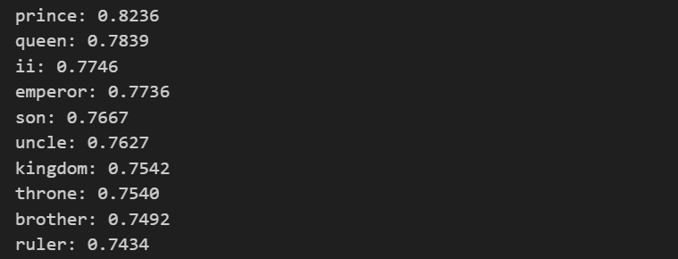
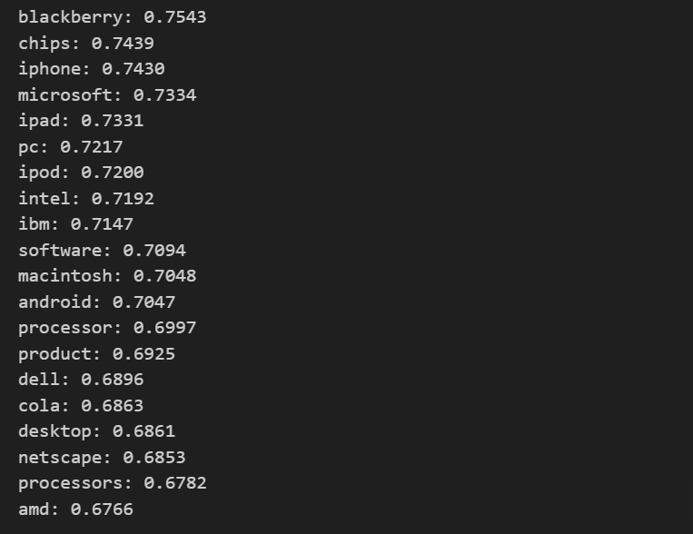
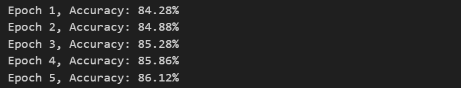
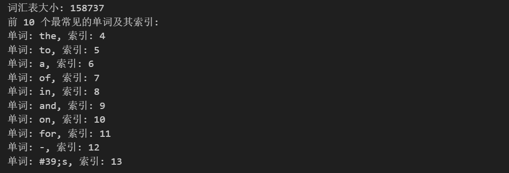
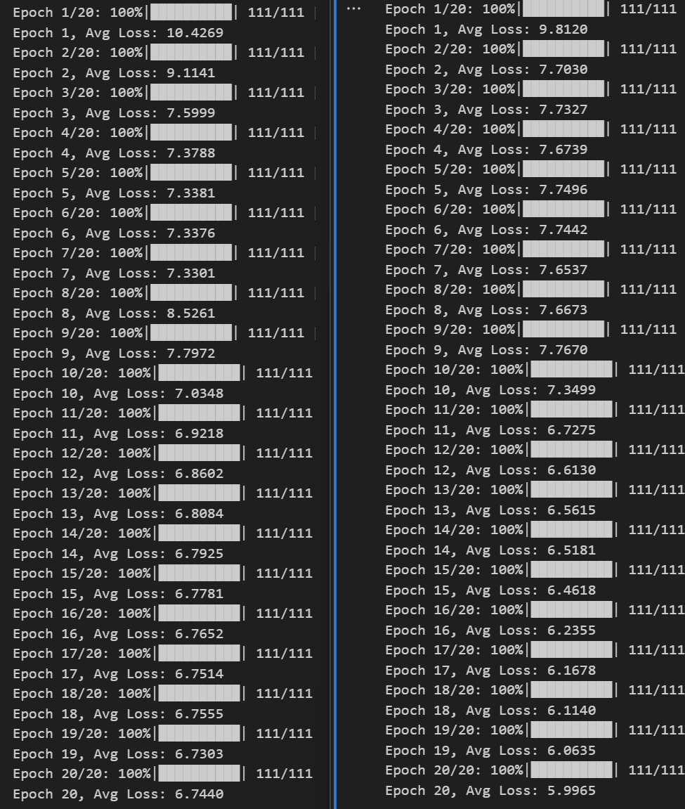

# 实验四 词嵌入和循环神经网络

## 任务一：词嵌入

### 1. 词嵌入

词嵌入是指用一个低维向量来表示单词。词嵌入被用作自然语言处理任务（如情感分类、问答、翻译等）的基本组成部分。因此，在本次实验中，我们了解词嵌入的构造并且直观感受词嵌入。

### 2. 探索词嵌入

#### 2.1 寻找相似的词

补全训练过程代码：

```python
import numpy as np
from scipy.spatial.distance import cosine

def find_top_similar_words(target_word, word_to_vec, top_n=5):
    """
    找到离 target_word 最近的 top_n 个单词（基于余弦相似度）

    :param target_word: 目标单词
    :param word_to_vec: 词向量字典 {word: vector}
    :param top_n: 返回最相近的单词数
    :return: [(word, similarity)] 排序后的列表
    """
    target_vector = word_to_vec[target_word]
    similarities = []

    for word, vector in word_to_vec.items():
        if word == target_word:
            continue  # 跳过自身
        similarity = 1 - cosine(target_vector, vector)  # 计算余弦相似度
        similarities.append((word, similarity))

    # 相似度降序排序
    similarities.sort(key=lambda x: x[1], reverse=True)

    return similarities[:top_n]

# 查找 "king" 最相似的 10 个单词
top_words = find_top_similar_words("king", word_to_vec, top_n=10)

# 打印结果
for word, sim in top_words:
    print(f"{word}: {sim:.4f}")
```

训练结果：



#### 2.2 多义词

有一些词往往具有多个意思比如苹果。请先思考一个多义词，并且使用 Glove 词嵌入进行验证。即 Glove 中与其最相似的 20 个单词中是否包含这两个意思的相关单词。最后，请给出这个单词并且打印跟其最相似的 20 个单词的相似度。

补全代码：

```python
import numpy as np
from scipy.spatial.distance import cosine

def find_top_similar_words(target_word, word_to_vec, top_n=5):
    """
    找到离 target_word 最近的 top_n 个单词（基于余弦相似度）

    :param target_word: 目标单词
    :param word_to_vec: 词向量字典 {word: vector}
    :param top_n: 返回最相近的单词数
    :return: [(word, similarity)] 排序后的列表
    """
    target_vector = word_to_vec[target_word]
    similarities = []

    for word, vector in word_to_vec.items():
        if word == target_word:
            continue  # 跳过自身
        similarity = 1 - cosine(target_vector, vector)  # 计算余弦相似度
        similarities.append((word, similarity))

    # 按相似度降序排序
    similarities.sort(key=lambda x: x[1], reverse=True)

    return similarities[:top_n]

# 选择多义词
target_word = "apple"
top_words = find_top_similar_words(target_word, word_to_vec, top_n=20)

# 打印结果
for word, sim in top_words:
    print(f"{word}: {sim:.4f}")
```

训练结果：



#### 2.3 使用词嵌入表示关系(类比)

有一个著名的例子是: 国王的词嵌入-男人的词嵌入约等于女王的词嵌入-女人的词嵌入，即 embedding(国王)-embedding(男人)≈embedding(女王)-embedding(女人)。

基于这个案例，我们可以用 embedding(china)-embedding(beijing)定义首都的关系。请基于中国-北京的得到的首都关系向量，找出英国的首都。英国使用 2 个单词 england 和 britain 进行探索，并且打印出相似度最高的 10 个单词。再用类似的方式找出伦敦(london)为首都对应的国家。

补全代码：

```python
import numpy as np
from scipy.spatial.distance import cosine

def find_top_similar_embeddings(target_embedding, word_to_vec, top_n=10):
    """
    根据一个词向量，找到最相似的 top_n 个单词（基于余弦相似度）

    :param target_embedding: 目标词向量 (numpy 数组)
    :param word_to_vec: 词向量字典 {word: vector}
    :param top_n: 返回最相近的单词数
    :return: [(word, similarity)] 排序后的列表
    """
    similarities = []

    # 遍历所有单词，计算余弦相似度
    for word, vec in word_to_vec.items():
        similarity = 1 - cosine(target_embedding, vec)  # 余弦相似度
        similarities.append((word, similarity))

    # 按相似度排序（降序）
    similarities.sort(key=lambda x: x[1], reverse=True)

    return similarities[:top_n]
#  获得以下单词的词嵌入
england_, china_, beijing_ = word_to_vec.get("england"), word_to_vec.get("china"),  word_to_vec.get("beijing")
britain_ = word_to_vec.get("britain")
london_ = word_to_vec.get("london")

capital_relation = china_ - beijing_

england_capital_vector = england_ - capital_relation
britain_capital_vector = britain_ - capital_relation

england_capital_candidates = find_top_similar_embeddings(england_capital_vector, word_to_vec, top_n=10)
britain_capital_candidates = find_top_similar_embeddings(britain_capital_vector, word_to_vec, top_n=10)

london_country_vector = london_ + capital_relation
london_country_candidates = find_top_similar_embeddings(london_country_vector, word_to_vec, top_n=10)

# 打印结果
print("\n基于 'china - beijing' 预测 'england' 的首都：")
for word, sim in england_capital_candidates:
    print(f"{word}: {sim:.4f}")

print("\n基于 'china - beijing' 预测 'britain' 的首都：")
for word, sim in britain_capital_candidates:
    print(f"{word}: {sim:.4f}")

print("\n基于 'london' 预测对应的国家：")
for word, sim in london_country_candidates:
    print(f"{word}: {sim:.4f}")
```

输出结果：

```txt
基于 'china - beijing' 预测 'england' 的首都：
england: 0.8717
birmingham: 0.8283
cardiff: 0.8212
nottingham: 0.8207
leeds: 0.8158
manchester: 0.8158
wales: 0.8013
melbourne: 0.7993
newcastle: 0.7918
scotland: 0.7829

基于 'china - beijing' 预测 'britain' 的首都：
britain: 0.8317
london: 0.7782
british: 0.7221
sydney: 0.7117
blair: 0.6826
ireland: 0.6615
england: 0.6547
australia: 0.6507
scotland: 0.6475
denmark: 0.6426

基于 'london' 预测对应的国家：
london: 0.8731
britain: 0.8154
british: 0.8105
australia: 0.7624
uk: 0.7593
zealand: 0.7505
australian: 0.7431
europe: 0.7372
u.k.: 0.7334
new: 0.7314
```

#### 2.4 词嵌入的不足

GloVe 词嵌入的主要不足在于它是静态的，无法根据上下文区分多义词，如“apple”无法区分水果和苹果公司。同时，它对未登录词（OOV）无能为力，遇到新词时无法生成合适的词向量。此外，GloVe 仅基于词的共现关系，难以捕捉复杂的语法和深层语义，如主动句和被动句的等价性。由于词向量固定，GloVe 也无法根据具体任务进行微调。

### 3. 使用词嵌入进行文本分类

代码补全：

```python
#TODO:定义文本分类网络
class TextClassifier(nn.Module):
    def __init__(self, vocab_size, embedding_dim, hidden_dim, num_classes):
        super(TextClassifier, self).__init__()

        #TODO: 实现模型结构
        #TODO 实现self.embedding: 嵌入层
        #TODO 实现self.fc: 分类层
        vocab_size, embedding_dim = embedding_matrix.shape
        self.embedding = nn.Embedding.from_pretrained(embedding_matrix, freeze=True)  # 使用预训练的 GloVe 词嵌入
        self.fc = nn.Linear(embedding_dim, num_classes)


    def forward(self, x):
        x = self.embedding(x)
        #TODO: 对一个句子中的所有单词的嵌入取平均得到最终的文档嵌入
        x = x.mean(dim=1)
        return self.fc(x)

# TODO: 实现训练函数，注意要把数据也放到gpu上避免报错
def train_model(model, dataloader, criterion, optimizer):
    model.train()
    for inputs, labels in dataloader:
        inputs, labels = inputs.to(device), labels.to(device, dtype=torch.long)
        optimizer.zero_grad()
        outputs = model(inputs)
        loss = criterion(outputs, labels)
        loss.backward()
        optimizer.step()


# TODO: 实现测试函数，返回在测试集上的准确率
def evaluate_model(model, dataloader):
    model.eval()
    correct, total = 0, 0
    with torch.no_grad():
        for inputs, labels in dataloader:
            inputs, labels = inputs.to(device), labels.to(device, dtype=torch.long)
            outputs = model(inputs)
            predictions = torch.argmax(outputs, dim=1)
            correct += (predictions == labels).sum().item()
            total += labels.size(0)
    return correct / total


# 初始化模型
device = torch.device("cuda" if torch.cuda.is_available() else "cpu")
embedding_matrix = torch.Tensor(embedding_matrix)
embedding_dim = embedding_matrix.shape[1]
hidden_dim = 128
num_classes = 4
model = TextClassifier(embedding_matrix, embedding_dim, hidden_dim, num_classes).to(device)

#TODO 实现criterion: 定义交叉熵损失函数
criterion = nn.CrossEntropyLoss()
optimizer = optim.Adam(model.parameters(), lr=0.001)

# 训练模型
EPOCHS = 5
for epoch in range(EPOCHS):
    train_model(model, train_loader, criterion, optimizer)
    acc = evaluate_model(model, test_loader)
    print(f"Epoch {epoch+1}, Accuracy: {acc*100:.2f}%")
```

训练结果：



#### 思考题 1

**使用 Glove 词嵌入进行初始化，是否比随机初始化取得更好的效果？**

答：看具体情况。在 NLP 任务中使用 Glove 词嵌入进行初始化通常效果更好，这种初始化方式有助于模型从一开始就有较好的语义理解，减少了训练过程中所需的时间和计算资源，尤其是在数据集较小或任务复杂时。而随机初始化往往需要更多的训练数据和时间来学习出有效的特征，且可能陷入局部最优解。

#### 思考题 2

**上述代码在不改变模型（即仍然只有 self.embedding 和 self.fc，不额外引入如 dropout 等层）和超参数（即 batch size 和学习率）的情况下，我们可以修改哪些地方来提升模型性能。请列举两个方面。**

答：

1. **改进文档嵌入表示**：使用如最大池化、加权池化或 RNN/LSTM/GRU 替代平均池化来获取更丰富的文档特征表示。
2. **解冻词嵌入层**：允许词嵌入层在训练过程中更新，以便根据任务需求微调预训练的词向量。

## 任务二：RNN、LSTM 和 GRU 文本生成任务

### 1. 文本预处理

补全代码：

```python
print("词汇表大小:", len(vocab_dict))
print("前 10 个最常见的单词及其索引:")
#TODO:打印前10个高频词元及其索引
for word, _ in counter.most_common(10):
    print(f"单词: {word}, 索引: {vocab_dict.get(word, '<unk>')}")
```

训练结果：



#### 思考题 1

**在文本处理中，为什么需要对文本进行分词（Tokenization）？**

答：分词将连续的文本流拆分成有意义的单元（如词或子词），使得模型能够理解和处理文本中的结构和语义。文本通过分词后，可以减少词汇表大小、提高模型的性能，并帮助处理未登录词（OOV）问题。合适的分词策略有助于捕捉词语的子结构信息，从而提升模型的效果，尤其在处理不同语言结构时，分词也是必要的标准化步骤。

#### 思考题 2

**在深度学习中，为什么不能直接使用单词而需要将其转换为索引？**

答：计算机无法直接处理自然语言中的单词，需要将其转换为数字索引，以便进行数学计算和存储。索引化后的单词可以通过词嵌入映射到低维稠密向量空间，捕捉单词间的语义关系，同时提高计算效率。数字化表示还能够解决 OOV 问题，并提升模型的泛化能力。

### 2. RNN 文本生成实验

#### 思考题 3

**如果不打乱训练集，会对生成任务有什么影响？**

答：可能导致模型只适应某些特定的上下文，忽略其他信息，从而影响训练稳定性和收敛速度，最终导致生成的文本缺乏多样性和自然性。

#### 困惑度评估

代码：

```python
def compute_perplexity(model, test_text, vocab_dict, seq_len=100):
    """
    计算给定文本的困惑度（Perplexity, PPL）

    :param model: 训练好的语言模型（RNN/LSTM）
    :param test_text: 需要评估的文本
    :param vocab_dict: 词汇表（用于转换文本到索引）
    :param seq_len: 评估时的窗口大小
    :return: PPL 困惑度
    """
    model.eval()  # 设为评估模式
    words = test_text.lower().split()

    # 将文本转换为 token ID，如果词不在词表中，则使用 "<unk>"（未知词）对应的索引
    token_ids = torch.tensor([vocab_dict.get(word, vocab_dict["<unk>"]) for word in words], dtype=torch.long)

    # 计算 PPL
    total_log_prob = 0
    num_tokens = len(token_ids) - 1  # 预测 num_tokens 次

    with torch.no_grad():
        for i in range(num_tokens):
            """遍历文本的每个 token，计算其条件概率，最后累加log概率"""
            input_seq = token_ids[max(0, i - seq_len):i].unsqueeze(0).to(device)  # 获取前 seq_len 个单词
            if input_seq.shape[1] == 0:  # 避免 RNN 输入空序列
                continue

            target_word = token_ids[i].unsqueeze(0).to(device)  # 目标单词

            # TODO: 前向传播，预测下一个单词的 logits
            output, _ = model(input_seq)
            # TODO: 计算 softmax 并取 log 概率
            logits = output.squeeze(0)  # 形状 (vocab_size,)
            probs = F.softmax(logits, dim=-1)
            # TODO: 取目标词的对数概率
            log_prob = torch.log(probs[target_word])
            # TODO: 累加 log 概率
            total_log_prob += log_prob.item()

    avg_log_prob = total_log_prob / num_tokens  # 计算平均 log 概率
    perplexity = torch.exp(torch.tensor(-avg_log_prob)) # 计算 PPL，公式 PPL = exp(-avg_log_prob)

    return perplexity.item()


# 示例用法
ppl = compute_perplexity(model, generated_text, vocab_dict)
print(f"Perplexity (PPL): {ppl:.4f}")
```

结果：


#### 思考题 4

**假设你在 RNN 和 LSTM 语言模型上分别计算了困惑度，发现 RNN 的 PPL 更低。这是否意味着 RNN 生成的文本一定更流畅自然？如果不是，在什么情况下这两个困惑度可以直接比较？**

答：PPL 较低的模型不一定生成更流畅自然的文本，因为 PPL 主要反映模型在预测下一个单词时的准确性，而不直接衡量文本的流畅性和自然性。RNN 可能在短期预测上表现较好，但在处理长期依赖时可能不如 LSTM。LSTM 通过更好地捕捉长期上下文生成的文本通常更加流畅。只有在相同的训练数据和训练过程下，或者相同的评估标准下两者可以直接比较。

#### 思考题 5

**困惑度是不是越低越好？**

答：不是。困惑度低通常表示模型在预测下一个单词时表现良好，但过低的 PPL 可能意味着模型过拟合，缺乏泛化能力，生成的文本可能缺乏多样性和创新性。

### 3. LSTM 和 GRU 文本生成实验

#### LSTM 困惑度计算

借助 RNN 文本生成任务中计算困惑度的函数，计算一下 lstm 在 generated_text 上的困惑度：

```python
# 计算 LSTM 在生成文本上的困惑度
ppl_lstm = compute_perplexity(model, generated_text, vocab_dict)
print(f"LSTM Perplexity (PPL): {ppl_lstm:.4f}")
```

结果：


#### 思考题 6

**观察一下 RNN 和 LSTM 训练过程中 loss 的变化，并分析一下造成这种现象的原因**

答：

- **RNN**的训练损失较为波动，且总体下降缓慢，原因主要在于它在处理长序列时无法有效捕捉长程依赖。
- **LSTM**通过门控机制更好地处理了长程依赖问题，导致其损失下降更加平稳，并最终趋于稳定。

#### GRU 困惑度计算

借助 RNN 文本生成任务中计算困惑的函数，计算一下 GRU 在 generated_text 上的困惑度。

```python
# 计算 GRU 在生成文本上的困惑度
ppl_gru = compute_perplexity(model, generated_text, vocab_dict)
print(f"GRU Perplexity (PPL): {ppl_gru:.4f}")
```

结果：


#### 思考题 7

**这三个困惑度可以直接比较吗？分析一下。**

答：可以，因为三者具有相同的训练数据和训练过程。

#### 思考题 8

**GRU 只有两个门（更新门和重置门），相比 LSTM 少了一个门控单元，这样的设计有什么优缺点？**

答：

- 优：GRU 相比 LSTM 计算更高效，参数更少，训练速度更快，且在部分任务上表现相当或更优。
- 缺：缺少独立的遗忘门，记忆控制不如 LSTM 细致，在长序列任务中可能稍逊于 LSTM。适用于计算资源有限或对长程依赖要求不高的场景。

#### 思考题 9

**在低算力设备（如手机）上，RNN、LSTM 和 GRU 哪个更适合部署？为什么？**

答：GRU ，因为它比 LSTM 参数更少、计算更高效，同时还能较好地捕捉长期依赖关系，属于折中方案。

- RNN 结构简单但难以处理长序列依赖，性能较差，不适合复杂任务。
- LSTM 处理长依赖能力强，但参数量大，计算开销高，对低算力设备不友好。

#### 思考题 10

**如果就是要使用 RNN 模型，原先的代码还有哪里可以优化的地方？请给出修改部分代码以及实验结果。**

答：可以对训练过程进行优化。

```python
def train_model(model, train_loader, epochs=5, clip=5.0):
    model.train()
    scheduler = torch.optim.lr_scheduler.StepLR(optimizer, step_size=5, gamma=0.5)  # 学习率衰减
    for epoch in range(epochs):
        total_loss = 0
        for X_batch, Y_batch in tqdm(train_loader, desc=f"Epoch {epoch + 1}/{epochs}"):
            X_batch, Y_batch = X_batch.to(device), Y_batch.to(device)
            optimizer.zero_grad()
            output, _ = model(X_batch)
            loss = criterion(output, Y_batch)
            loss.backward()
            torch.nn.utils.clip_grad_norm_(model.parameters(), clip)  # 梯度裁剪
            optimizer.step()
            total_loss += loss.item()
        scheduler.step()  # 更新学习率
        print(f"Epoch {epoch + 1}, Avg Loss: {total_loss / len(train_loader):.4f}")
```

结果：左为优化前，右为优化后，可以观察到优化后的训练 Loss 下降速度快于优化前，最终 Loss 也低于优化前。



## 实验心得与体会

在本次实验中，我主要完成了两个部分：词嵌入实验和 RNN、LSTM、GRU 文本生成实验。通过这次实验，我对词嵌入的概念、循环神经网络（RNN）、长短时记忆网络（LSTM）和门控循环单元（GRU）的基本原理有了更深的理解，同时也掌握了如何在 PyTorch 框架下实现这些模型，并应用于文本分类与文本生成任务。

---

### 1. 词嵌入的应用价值

词嵌入能够捕捉单词的语义信息，并且可以应用于文本分类、机器翻译、情感分析、文本生成等多个任务。此外，不同的嵌入维度会影响模型效果，需要根据任务需求进行选择。

### 2. RNN、LSTM 和 GRU 的对比

| **模型** | **优点**                     | **缺点**                   | **适用场景**       |
| -------- | ---------------------------- | -------------------------- | ------------------ |
| **RNN**  | 结构简单，计算快             | 易梯度消失，难捕捉长程依赖 | 短文本建模         |
| **LSTM** | 解决梯度消失问题，适合长序列 | 计算复杂度较高             | 长文本、机器翻译   |
| **GRU**  | 计算效率较高，效果接近 LSTM  | 无法完全替代 LSTM          | 计算资源有限的场景 |
