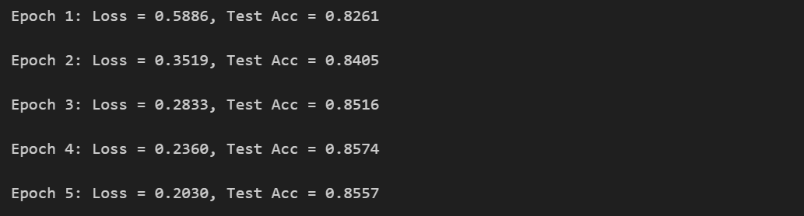
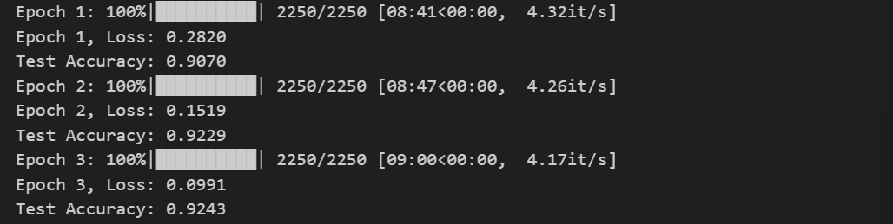

# 实验五 Transformer 与预训练语言模型

## 任务一：Transformer

### 1. Transformer 编码器中 Encoder Layer 的实现

#### 位置编码器

代码补全：

```python
#这段代码是 Transformer中的位置编码（PositionalEncoding），用于给输入的 token embedding 加入位置信息。
class PositionalEncoding(nn.Module):
    def __init__(self, d_model, max_len=5000):
        super().__init__()

        # 创建一个全0的矩阵，shape = (max_len, d_model)
        # 表示每个位置 (0 ~ max_len-1) 对应的 d_model 维位置编码
        pe = torch.zeros(max_len, d_model)

        # 生成位置索引，shape = (max_len, 1)
        # 即 position = [0, 1, 2, ..., max_len-1] 的列向量
        position = torch.arange(0, max_len).unsqueeze(1)

        # TODO 1: 计算 div_term，用于控制不同维度的 sin/cos 频率
        # 要求: 使用 torch.exp() 实现 1 / 10000^(2i/d_model)
        div_term = torch.exp(torch.arange(0, d_model, 2) * (-torch.log(torch.tensor(10000.0)) / d_model))

        # TODO 2: 给偶数维度位置编码赋值
        # 要求: 使用 torch.sin() 完成 position * div_term，赋值给 pe 的偶数列
        pe[:, 0::2] = torch.sin(position * div_term)

        # TODO 3: 给奇数维度位置编码赋值
        # 要求: 使用 torch.cos() 完成 position * div_term，赋值给 pe 的奇数列
        pe[:, 1::2] = torch.cos(position * div_term)

        # 将 pe 注册为 buffer（不会被训练优化）
        # 并扩展成 (1, max_len, d_model) 方便后续和 batch 做广播
        self.register_buffer('pe', pe.unsqueeze(0))  # shape: (1, max_len, d_model)

    def forward(self, x):
        # x 是输入的 embedding，shape = (batch_size, seq_len, d_model)

        # 将对应位置的 pe 加到 x 上
        # self.pe[:, :x.size(1)] shape = (1, seq_len, d_model) 自动广播到 batch_size
        x = x + self.pe[:, :x.size(1)]

        # 返回位置编码后的 embedding
        return x
```

#### 思考题 1

**为什么需要对偶数和奇数维度分别使用 sin 和 cos？**

答：`sin` 和 `cos` 具有不同的相位偏移，使得相邻位置既具备相似性，又能区分；同时它们的周期性保证了相对位置的稳定性，帮助模型泛化到不同长度的序列，并通过线性变换高效捕捉位置信息。

#### Multi-Head Self-Attention 模块

代码补全：

```python
# Multi-Head Self-Attention 的完整实现
class MultiHeadSelfAttention(nn.Module):
    def __init__(self, d_model, n_heads):
        super().__init__()
        # 保证 d_model 可以被 n_heads 整除，方便分头
        assert d_model % n_heads == 0
        self.d_k = d_model // n_heads # 每个 head 的特征维度
        self.n_heads = n_heads

        # 共享一个 Linear 层同时生成 Q, K, V
        self.qkv_linear = nn.Linear(d_model, d_model * 3) # 输出为 [Q; K; V]

        # 输出层，将多头的结果重新映射回 d_model 维度
        self.fc = nn.Linear(d_model, d_model)

    def forward(self, x, mask=None):
        # 输入 x: (batch_size, seq_len, d_model)
        batch_size, seq_len, d_model = x.size()

        # 一次性计算 Q、K、V，输出 shape = (batch_size, seq_len, 3 * d_model)
        qkv = self.qkv_linear(x)

        # 切分成 n_heads 个 head，准备 multi-head attention
        # shape 变为 (batch_size, seq_len, n_heads, 3 * d_k)
        qkv = qkv.view(batch_size, seq_len, self.n_heads, 3 * self.d_k)

        # 调整维度顺序，变成 (batch_size, n_heads, seq_len, 3 * d_k)
        qkv = qkv.permute(0, 2, 1, 3)  # (batch_size, n_heads, seq_len, 3*d_k)

        # 沿最后一个维度切成 Q, K, V，shape = (batch_size, n_heads, seq_len, d_k)
        q, k, v = qkv.chunk(3, dim=-1)  # (batch_size, n_heads, seq_len, d_k)

        # TODO 1: 计算 attention scores
        # 要求: 使用缩放点积的方式计算 (Q x K^T)，并除以 sqrt(d_k)
        scores = torch.matmul(q, k.transpose(-2, -1)) / torch.sqrt(torch.tensor(self.d_k, dtype=torch.float32))

        # mask 操作，屏蔽掉 padding 部分
        if mask is not None:
            scores = scores.masked_fill(mask == 0, -1e9)

        # TODO 2: 计算 attention 权重
        # 要求: 在 seq_len 维度上使用 softmax 归一化 scores
        attn = torch.softmax(scores, dim=-1)

        # TODO 3: 计算加权求和后的 context
        # 要求: 用 attn 加权 V，得到 context
        context = torch.matmul(attn, v)

        # 将多头拼接回去，shape = (batch_size, seq_len, n_heads * d_k) = (batch_size, seq_len, d_model)
        context = context.transpose(1, 2).contiguous().view(batch_size, seq_len, d_model)

        # 通过输出层，再映射回原始 d_model 维度
        return self.fc(context)
```

#### 思考题 2

**在 Multi-Head Self-Attention 机制中，为什么我们需要使用多个 attention head？**

答：使用多个 attention heads 使得模型能够从不同的角度并行地学习输入序列中的信息，每个 head 关注不同的特征或依赖关系。这提高了模型的表达能力，能够捕捉到更多样化的上下文信息，并减少信息丢失，从而更好地处理复杂的输入数据。

#### 思考题 3

**为什么要用缩放因子 sqrt(d_k)？**

答：为了防止点积结果过大，保证数值稳定性。随着维度增加，点积结果也会增大，可能导致 `softmax` 输出过于集中，从而影响梯度计算和训练效果。通过缩放，可以避免这种情况，确保模型训练过程的稳定性。

#### TransformerEncoderLayer

下面的代码实现了 Transformer 编码器中的一个标准 Encoder Layer，包含：

“多头自注意力 + 前馈网络 + 两次残差连接 + 两次 LayerNorm” 的结构，用于对输入序列进行特征建模和上下文信息融合。

请你按照要求补全代码：

```python
class TransformerEncoderLayer(nn.Module):
    def __init__(self, d_model, n_heads, d_ff):
        super().__init__()

        # 多头自注意力模块，输入输出维度都是 d_model
        self.self_attn = MultiHeadSelfAttention(d_model, n_heads)

        # 前馈全连接层，包含两层线性 + ReLU
        self.ff = nn.Sequential(
            nn.Linear(d_model, d_ff),
            nn.ReLU(),
            nn.Linear(d_ff, d_model)
        )

        # 第一层 LayerNorm，作用在自注意力的残差连接之后
        self.norm1 = nn.LayerNorm(d_model)
        # 第二层 LayerNorm，作用在前馈网络的残差连接之后
        self.norm2 = nn.LayerNorm(d_model)

    def forward(self, x, mask=None):
        # ------------------ 自注意力块 ------------------ #

        # TODO 1: 计算多头自注意力输出 x2
        x2 = self.self_attn(x, mask)

        # TODO 2: 残差连接 + 第一层 LayerNorm
        x = self.norm1(x + x2)

        # ------------------ 前馈神经网络块 ------------------ #

        # TODO 3: 前馈全连接网络（两层 Linear + ReLU）得到 x2
        x2 = self.ff(x)

        # TODO 4: 残差连接 + 第二层 LayerNorm
        x = self.norm2(x + x2)

        return x
```

#### 思考题 4

**为什么 Transformer Encoder Layer 中要在 Self-Attention 和 Feed Forward Network 之后都使用残差连接和 LayerNorm？试从“模型训练稳定性”和“特征传递”两个角度进行分析。**

答：

- 提高训练稳定性，避免梯度消失或爆炸问题，并加速网络的收敛。残差连接通过直接传递输入到输出，确保信息流动顺畅，防止特征丢失，而 **LayerNorm** 保持每一层输出的一致数值范围，避免数值不稳定。
- 有助于特征传递，确保每层的特征能够顺利传递和融合。残差连接让网络能够保留低层的有用特征，同时在每一层加入新特征信息，LayerNorm 进一步优化输出特征的尺度，帮助网络有效地处理深层信息。

### 2. 基于 Transformer Encoder 的文本分类器

#### 思考题 5

**为什么在 TransformerEncoderClassifier 中，通常会在 Encoder 的输出上做 mean pooling（对 seq_len 取平均）？除了 mean pooling，你能否想到其他可以替代的 pooling 或特征聚合方式？并简要分析它们的优缺点。**

答：因为它能够将序列中所有 token 的特征进行平均，从而生成一个固定长度的表示，适用于分类任务，且计算简单有效。替代方法：

1. **Max Pooling**：突出显著特征
2. **Sum Pooling**：保留整体信息，但可能导致尺度问题
3. **Attention Pooling**：动态聚焦重要部分，但计算复杂
4. **CLS Token**：通过特殊 token 学习整体表示

#### 模型训练结果



#### 思考题 6

**Transformer 相比传统的 RNN/CNN，优势在哪里？为什么 Transformer 更适合处理长文本？**

**Transformer** 通过自注意力机制实现了并行计算和长距离依赖建模，能够有效捕捉全局上下文信息，避免了 RNN 的梯度问题，并克服了 CNN 的局部感受野限制。此外，Transformer 结构高度并行，易于扩展和处理长序列，因此在长文本任务中表现更为高效和准确。

## 任务二：预训练语言模型

### 1. 使用 GPU 训练模型

在 PyTorch 中，可以使用以下代码来检测当前环境是否有可用的 GPU：

```python
import torch

# 检查是否有可用的GPU
if torch.cuda.is_available():
    print(f"CUDA is available. Number of GPUs: {torch.cuda.device_count()}")
    print(f"Current device: {torch.cuda.current_device()}")
    print(f"Device name: {torch.cuda.get_device_name(torch.cuda.current_device())}")
else:
    print("CUDA is not available. Using CPU.")
```

定义模型后，通过 model = model.to(device)把模型放到 GPU 上。 把模型放到 GPU 上的代码示例：

```python
# 检查是否有可用的GPU
device = torch.device('cuda' if torch.cuda.is_available() else 'cpu')

# 创建模型
model = SimpleModel()

# 将模型放到GPU（如果可用）
model = model.to(device)
```

由于模型在 GPU 上，所以数据也必须在 GPU 上才能送入模型。通过 inputs = inputs.to(device)把 input 放到 GPU 上。值得说明的是由于模型的输出也在 GPU 上，所以标签也需要放到 GPU 上以便于计算损失，通过 labels = labels.to(device)。

把数据放到 GPU 上的代码示例：

```python
import torch
import torch.nn as nn
import torch.optim as optim
from torch.utils.data import DataLoader

# 训练示例
num_epochs = 3
for epoch in range(num_epochs):
    model.train()
    for inputs, labels in train_loader:
        # 将数据放到GPU（如果可用）
        inputs, labels = inputs.to(device), labels.to(device)

        # 前向传播
        outputs = model(inputs)
```

通过上述过程，我们可以把数据和模型都放到 GPU 上从而加速训练。

你可以使用以下命令查看是否使用了 GPU 并且观察的 GPU 利用率：

```
watch -n 5 nvidia-smi
```

这个命令会每 5 秒（-n 5）更新一次 NVIDIA GPU 的状态信息。

### 2. 了解预训练语言模型

以 BERT 为例，用的 bert-base-uncased 版本进行实验。我们首先用 AutoModel 和 AutoTokenizer 加载模型和分词器。分词器是把文本的每个词元映射到对应的索引，以便于 BERT 的 embedding 层完成索引到嵌入的映射。

完整代码如下：

```python
import torch
from transformers import AutoModel, AutoTokenizer

# 指定模型名称
model_name = 'bert-base-uncased'

# 读取模型对应的tokenizer
tokenizer = AutoTokenizer.from_pretrained(model_name)

# 载入模型
model = AutoModel.from_pretrained(model_name)

# 输入文本
input_text = "Here is some text to encode"

# 通过tokenizer把文本变成 token_id
input_ids = tokenizer.encode(input_text, add_special_tokens=True)
print(input_ids)

# 转换为Tensor
input_ids = torch.tensor([input_ids])

# 获得BERT的输出
with torch.no_grad():
    output = model(input_ids)

# 获得BERT模型最后一个隐层结果
output_hidden_states = output.last_hidden_state
output_hidden_states.shape
```

分词（tokenizer）的过程会在文本的头尾添加特殊 token，即会在文本的开头加入词元[CLS]并且在文本的结尾加入词元[SEP]。你可以调整 input_text 和设置 add_special_tokens=False，观察到这两个词元分别被编码为 101 和 102。

除此之外，由于批处理过程需要一个批次中文本长度相同，因此额外引入了 padding。所以，我们需要使用了 attention_mask 屏蔽这些 padding token，不让其参与自注意力的计算。

最终的输出是文本中所有词元的隐藏状态（hidden states）。

我们可以用 model.named_parameters(): 观察模型的所有参数及其形状，完整代码如下：

```python
import torch
from transformers import AutoModel, AutoTokenizer

# 指定模型名称
model_name = 'bert-base-uncased'

# 读取模型对应的tokenizer
tokenizer = AutoTokenizer.from_pretrained(model_name)

# 载入模型
model = AutoModel.from_pretrained(model_name)

# 打印模型所有参数的名称和形状
for name, param in model.named_parameters():
    print(f"Parameter Name: {name}, Shape: {param.shape}")
```

### 3. 使用预训练模型进行文本分类

补全代码：

```python
import torch
import pandas as pd
import numpy as np
from torch.utils.data import Dataset, DataLoader
from transformers import AutoTokenizer, AutoModelForSequenceClassification, AdamW
from sklearn.model_selection import train_test_split
from sklearn.metrics import accuracy_score
from tqdm import tqdm

# **1. 加载 AG NEWS 数据集**
df = pd.read_csv("./ag/train.csv")  # 请替换成你的文件路径
df.columns = ["label", "title", "description"]  # CSV 有3列: 标签, 标题, 描述
df["text"] = df["title"] + " " + df["description"]  # 合并标题和描述作为输入文本
df["label"] = df["label"] - 1  # AG NEWS 的标签是 1-4，我们转换成 0-3
train_texts, train_labels = df["text"].tolist(), df["label"].tolist()
number = int(0.3 * len(train_texts))
train_texts, train_labels = train_texts[: number], train_labels[: number]

df = pd.read_csv("./ag/test.csv")  # 请替换成你的文件路径
df.columns = ["label", "title", "description"]  # CSV 有3列: 标签, 标题, 描述
df["text"] = df["title"] + " " + df["description"]  # 合并标题和描述作为输入文本
df["label"] = df["label"] - 1  # AG NEWS 的标签是 1-4，我们转换成 0-3
test_texts, test_labels = df["text"].tolist(), df["label"].tolist()

# **2. 加载 BERT Tokenizer**
model_name = "bert-base-uncased"
tokenizer = AutoTokenizer.from_pretrained(model_name)

# **3. 处理数据**
class AGNewsDataset(Dataset):
    def __init__(self, texts, labels, tokenizer, max_length=50):
        self.texts = texts
        self.labels = labels
        self.tokenizer = tokenizer
        self.max_length = max_length

    def __len__(self):
        return len(self.texts)

    def __getitem__(self, idx):
        text = self.texts[idx]
        label = self.labels[idx]
        encoding = self.tokenizer(
            text, truncation=True, padding="max_length", max_length=self.max_length, return_tensors="pt"
        )
        return {
            "input_ids": encoding["input_ids"].squeeze(0),
            "attention_mask": encoding["attention_mask"].squeeze(0),
            "labels": torch.tensor(label, dtype=torch.long),
        } # 此处会自动生成BERT输入所需要的attention_mask


train_dataset = AGNewsDataset(train_texts, train_labels, tokenizer)
test_dataset = AGNewsDataset(test_texts, test_labels, tokenizer)

train_dataloader = DataLoader(train_dataset, batch_size=16, shuffle=True)
test_dataloader = DataLoader(test_dataset, batch_size=16, shuffle=False)

# **4. 定义和加载BERT分类模型**
#TODO:定义模型并且放到GPU上

class BERTClassifier(nn.Module):
    def __init__(self, model_name, num_labels):
        super(BERTClassifier, self).__init__()
        self.bert = AutoModelForSequenceClassification.from_pretrained(model_name, num_labels=num_labels)
        self.classifier = nn.Linear(self.bert.config.hidden_size, num_labels)

    def forward(self, input_ids, attention_mask):
        outputs = self.bert(input_ids, attention_mask=attention_mask)
        return outputs.logits

device = torch.device('cuda')
model = BERTClassifier(model_name, num_labels=4).to(device)


# **5. 设置优化器和损失函数**
#TODO: 定义优化器和损失函数
optimizer = AdamW(model.parameters(), lr=2e-5)
loss_fn = torch.nn.CrossEntropyLoss()

# **6. 训练 BERT**
EPOCHS = 3

for epoch in range(EPOCHS):
    model.train()
    total_loss = 0
    loop = tqdm(train_dataloader, desc=f"Epoch {epoch+1}")

    for batch in loop:
        #TODO: 基于后面需要打印的损失，定义训练过程
        inputs, attention_mask, labels = batch["input_ids"].to(device), batch["attention_mask"].to(device), batch["labels"].to(device)

        # 前向传播
        optimizer.zero_grad()
        outputs = model(inputs, attention_mask)
        loss = loss_fn(outputs, labels)

        # 反向传播
        loss.backward()
        optimizer.step()

        total_loss += loss.item()

    print(f"Epoch {epoch+1}, Loss: {total_loss/len(train_dataloader):.4f}")

    # **7. 评估模型**
    model.eval()
    preds, true_labels = [], []

    with torch.no_grad():
        for batch in test_dataloader:
            #TODO: 基于后面计算acc需要的true_labels和preds，完善下面测试代码
            inputs, attention_mask, labels = batch["input_ids"].to(device), batch["attention_mask"].to(device), batch["labels"].to(device)

            outputs = model(inputs, attention_mask)
            logits = outputs

            # 获取预测标签
            _, predicted = torch.max(logits, dim=1)
            preds.extend(predicted.cpu().numpy())
            true_labels.extend(labels.cpu().numpy())


    acc = accuracy_score(true_labels, preds)
    print(f"Test Accuracy: {acc:.4f}")
```

结果：



#### 思考题 1

**你觉得以上三种得到句子嵌入的方案，哪种效果会最好，哪种效果会最差？为什么？**

答：

- **效果最好**：注意力机制加权求和。这种方法能够动态调整每个词元的权重，根据上下文信息加权不同部分，通常能得到更加精确的句子表示，特别是在需要捕捉长距离依赖和细粒度信息的任务中。
- **效果较差**：mean pooling。虽然这种方法简单且易于实现，但它对所有词元赋予相同权重，可能忽略了某些关键部分的上下文信息，尤其在任务需要区分句子中的重要信息时可能表现不佳。

#### 思考题 2

**如果一个文档包括多个句子，我们需要获得其中每个句子的嵌入表示。那么，我们应该怎么利用 BERT 得到每个句子的嵌入？**

答：

- `[CLS]` Token 嵌入：直接使用每个句子中的 `[CLS]` token 的隐藏状态作为句子的表示。简单且高效，但可能忽略句子中其他部分的信息。
- 平均池化：对每个句子中所有词的嵌入进行平均，综合考虑所有词的信息。优点是简单且能捕捉句子的整体信息，但不考虑词的重要性差异。
- 注意力机制池化：为句子中每个词元分配不同的权重，突出重要词汇的信息。效果好，但计算开销较大。

## 实验心得与体会

在本次实验中，我学习并实践了 Transformer 模型和预训练语言模型的相关内容。实验分为两个任务，分别是 Transformer 与预训练语言模型。以下是我在实验过程中的心得与体会：

### 任务一：Transformer

在任务一中，我深入理解了 Transformer 的核心组件，包括位置编码、多头自注意力机制和 Transformer 编码器。首先，位置编码的作用是为模型提供序列中单词的顺序信息，弥补了 Transformer 模型本身不具备顺序处理的能力。通过对比不同类型的编码方式，我更好地理解了位置编码在自然语言处理任务中的重要性。

接着，通过实现多头自注意力机制，我对其如何同时关注序列中不同位置的不同信息有了更清晰的认识。多头自注意力机制通过并行计算不同的注意力头，能够捕捉到更多样化的信息，提高了模型的表达能力。

在设计和实现 Transformer 编码器时，我认识到 Transformer 编码器结构是模块化的，能够灵活堆叠多个编码器层，从而适应不同的任务需求。这一结构使得 Transformer 可以在处理长文本时保持较高的计算效率和准确性。通过结合多头自注意力和前馈网络，Transformer 能够在各种自然语言处理任务中提供良好的表现。

### 任务二：预训练语言模型

在任务二中，我了解了如何使用 GPU 加速模型训练，并掌握了使用预训练语言模型（如 BERT）进行文本分类的流程。通过将模型和数据迁移到 GPU，我大幅提高了训练效率，使得大规模数据集的训练变得更加可行。

此外，我深入理解了预训练语言模型的概念，并通过 BERT 模型进行文本分类任务的实现。使用 BERT 模型，尤其是通过使用`[CLS]` token 或池化操作来获取句子的嵌入表示，使得模型能够更加高效地进行文本分类任务。
