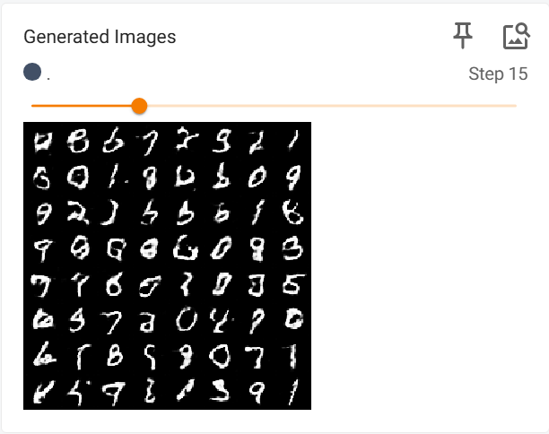

# 实验六 生成对抗网络（GAN）

## 任务一：GAN

### 1. 了解 GAN 的基本概念

生成对抗网络（GAN）是一种生成模型，它的目标是学习数据的分布，从而能够生成与真实数据分布相似的样本。GAN 通过一种对抗的方式进行训练，利用两个神经网络（生成器和判别器）相互博弈，最终使生成器能够生成高质量的、以假乱真的数据。

GAN 包含有两个模型，一个是生成模型（generative model），一个是判别模型(discriminative model)。生成模型的任务是生成看起来自然真实的、和原始数据相似的实例。判别模型的任务是判断给定的实例看起来是自然真实的还是人为伪造的（真实实例来源于数据集，伪造实例来源于生成模型）。

### 2. GAN 的实现

#### 实现生成器代码

```python
class Generator(nn.Module):
    def __init__(self, input_dim, hidden_dim, output_dim):
        super(Generator, self).__init__()
        self.model = nn.Sequential(
            #TODO           # 使用线性层将随机噪声映射到第一个隐藏层
            nn.Linear(input_dim, hidden_dim),  # 线性层: 输入随机噪声 -> 隐藏层 1
            nn.ReLU(),      # 使用 ReLU 作为激活函数，帮助模型学习非线性特征
            #TODO           # 使用线性层将第一个隐藏层映射到第二个隐藏层
            nn.Linear(hidden_dim, hidden_dim),  # 线性层: 隐藏层 1 -> 隐藏层 2
            nn.ReLU(),      # 再次使用 ReLU 激活函数
            #TODO           # 使用线性层将第二个隐藏层映射到输出层，输出为图像的像素大小
            nn.Linear(hidden_dim, output_dim),  # 线性层: 隐藏层 2 -> 输出层（图像像素）
            nn.Tanh()       # 使用 Tanh 将输出归一化到 [-1, 1]，适用于图像生成
        )

    def forward(self, x):
        #TODO               # 前向传播：将输入 x 通过模型进行计算，得到生成的图像
        return self.model(x)

```

#### 实现判别器代码

```python
class Discriminator(nn.Module):
    def __init__(self, input_dim, hidden_dim):
        super(Discriminator, self).__init__()
        self.model = nn.Sequential(
            #TODO   # 输入层到第一个隐藏层，使用线性层
            nn.Linear(input_dim, hidden_dim),
            #TODO   # 使用 LeakyReLU 激活函数，避免梯度消失问题，negative_slope参数设置为0.1
            nn.LeakyReLU(negative_slope=0.1),
            #TODO   # 第一个隐藏层到第二个隐藏层，使用线性层
            nn.Linear(hidden_dim, hidden_dim),
            #TODO   # 再次使用 LeakyReLU 激活函数，negative_slope参数设置为0.1
            nn.LeakyReLU(negative_slope=0.1),
            #TODO   # 第二个隐藏层到输出层，使用线性层
            nn.Linear(hidden_dim, 1),
            #TODO   # 使用 Sigmoid 激活函数，将输出范围限制在 [0, 1]
            nn.Sigmoid()
        )

    def forward(self, x):
        #TODO       # 前向传播：将输入 x 通过模型进行计算，得到判别结果
        return self.model(x)
```

#### 思考题 1

**为什么 GAN 的训练被描述为一个对抗过程？这种对抗机制如何促进生成器的改进？**

答：

- GAN 的训练中，生成器试图从随机噪声生成逼真的数据，以欺骗判别器，而判别器则不断优化，以区分真实数据和生成数据。这种博弈关系看起来就像是生成器和判别器在”对抗“。
- 这种对抗机制使 G 在面对一个不断进步的 D 时被迫学习更复杂的特征，使生成的样本更加真实。同时，D 作为反馈信号，指导 G 逐步改进，使得整个模型无需显式标注数据即可学习到数据的潜在分布，实现高质量的生成能力。

#### 思考题 2

**ReLU 和 LeakyReLU 各有什么特征？为什么在生成器中使用 ReLU 而在判别器中使用 LeakyReLU？**

答：

- ReLU 通过 $f(x) = \max(0, x)$ 使正值区间保持梯度，计算高效，适用于生成器（G），帮助其学习复杂特征并生成逼真的数据。但 ReLU 在负值区间梯度为 0，可能导致神经元死亡，不过对 G 影响较小。
- LeakyReLU 通过 $f(x) = x$（正值）和 $\alpha x$（负值，通常 $\alpha=0.1$）允许小梯度通过，避免梯度消失问题，更适用于判别器（D）。这样 D 能更稳定地学习数据分布，提高辨别真假样本的能力，使 GAN 训练更加稳定。

#### 补充主函数代码

```python
def main():

    # 设备配置：使用 GPU（如果可用），否则使用 CPU
    device = torch.device('cuda:0' if torch.cuda.is_available() else 'cpu')

    # 设置模型和训练的超参数
    input_dim = 100  # 生成器输入的随机噪声向量维度
    hidden_dim = 256  # 隐藏层维度
    output_dim = 28 * 28  # MNIST 数据集图像尺寸（28x28）
    batch_size = 128  # 训练时的批量大小
    num_epoch = 30 # 训练的总轮数

    # 加载 MNIST 数据集
    train_dataset = datasets.MNIST(root="./data/", train=True, transform=transforms.ToTensor(), download=True)
    train_loader = DataLoader(dataset=train_dataset, batch_size=batch_size, shuffle=True)

    # 创建生成器G和判别器D，并移动到 GPU（如果可用）
    #TODO   # 生成器G
    G = Generator(input_dim, hidden_dim, output_dim).to(device)
    #TOOD   # 判别器D
    D = Discriminator(output_dim, hidden_dim).to(device)

    # 定义针对生成器G的优化器optim_G和针对判别器D的优化器optim_D，要求使用Adam优化器，学习率设置为0.0002
    #TODO  # 生成器优化器optim_G
    optim_G = torch.optim.Adam(G.parameters(), lr=0.0002, betas=(0.5, 0.999))
    #TODO  # 判别器优化器optim_D
    optim_D = torch.optim.Adam(D.parameters(), lr=0.0002, betas=(0.5, 0.999))


    loss_func = nn.BCELoss()  # 使用二元交叉熵损失

    # 初始化 TensorBoard
    writer = SummaryWriter(log_dir='./logs/experiment_gan')

    # 开始训练
    for epoch in range(num_epoch):
        total_loss_D, total_loss_G = 0, 0
        for i, (real_images, _) in enumerate(train_loader):
            loss_D = train_discriminator(real_images, D, G, loss_func, optim_D, batch_size, input_dim, device)  # 训练判别器
            loss_G = train_generator(D, G, loss_func, optim_G, batch_size, input_dim, device)  # 训练生成器

            total_loss_D += loss_D
            total_loss_G += loss_G

            # 每 100 步打印一次损失
            if (i + 1) % 100 == 0 or (i + 1) == len(train_loader):
                print(f'Epoch {epoch:02d} | Step {i + 1:04d} / {len(train_loader)} | Loss_D {total_loss_D / (i + 1):.4f} | Loss_G {total_loss_G / (i + 1):.4f}')

            # 记录每个epoch的平均损失到 TensorBoard
        writer.add_scalar('GAN/Loss/Discriminator', total_loss_D / len(train_loader), epoch)
        writer.add_scalar('GAN/Loss/Generator', total_loss_G / len(train_loader), epoch)

        # 生成并保存示例图像
        with torch.no_grad():
            noise = torch.randn(64, input_dim, device=device)
            fake_images = G(noise).view(-1, 1, 28, 28)  # 调整形状为图像格式

            # 记录生成的图像到 TensorBoard
            img_grid = torchvision.utils.make_grid(fake_images, normalize=True)
            writer.add_image('Generated Images', img_grid, epoch)
```

#### 实现 train_discriminator 和 train_generator

```python
# =============================== 训练判别器 ===============================
def train_discriminator(real_images, D, G, loss_func, optim_D, batch_size, input_dim, device):
    '''训练判别器'''

    batch_size = real_images.size(0)

    real_images = real_images.view(-1, 28 * 28).to(device)  # 获取真实图像并展平
    real_output = D(real_images)  # 判别器预测真实图像
    #TODO   # 计算真实样本的损失real_loss
    real_labels = torch.ones(batch_size, 1, device=device)  # 真实样本的标签设为 1
    fake_labels = torch.zeros(batch_size, 1, device=device)  # 生成样本的标签设为 0
    real_loss = loss_func(real_output, real_labels)

    noise = torch.randn(batch_size, input_dim, device=device)  # 生成随机噪声
    fake_images = G(noise).detach()  # 生成假图像（detach 避免梯度传递给 G）
    fake_output = D(fake_images)  # 判别器预测假图像
    #TODO   # 计算假样本的损失fake_loss
    fake_loss = loss_func(fake_output, fake_labels)

    loss_D = real_loss + fake_loss  # 判别器总损失
    optim_D.zero_grad()  # 清空梯度
    loss_D.backward()  # 反向传播
    optim_D.step()  # 更新判别器参数

    return loss_D.item()  # 返回标量损失

# =============================== 训练生成器 ===============================
def train_generator(D, G, loss_func, optim_G, batch_size, input_dim, device):
    '''训练生成器'''
    noise = torch.randn(batch_size, input_dim, device=device)  # 生成随机噪声
    fake_images = G(noise)  # 生成假图像
    fake_output = D(fake_images)  # 判别器对假图像的判断
    #TODO # 计算生成器损失（希望生成的图像判别为真）
    fake_labels = torch.ones(batch_size, 1, device=device)  # 生成器希望生成的图像被判别器认为是真
    loss_G = loss_func(fake_output, fake_labels)

    optim_G.zero_grad()  # 清空梯度
    loss_G.backward()  # 反向传播
    optim_G.step()  # 更新生成器参数

    return loss_G.item()  # 返回标量损失
```

#### 执行 main 函数

结果如下：


### 3. 使用 TensorBoard 可视化训练过程

部分结果如下：


#### 思考题 3

**尝试使用 TensorBoard 可视化 GAN 模型的生成器和判别器的模型结构图。**

如下：


## 任务二：DCGAN

### 1. GAN 与 DCGAN 的区别

标准 GAN 主要由全连接层构成，生成器使用全连接网络从随机噪声生成数据，而判别器使用全连接网络对输入数据进行分类。GAN 存在的问题包括：

- 训练不稳定，容易出现模式崩溃（Mode Collapse）。
- 生成的图像质量较低，缺乏空间结构信息。

深度卷积生成对抗网络（DCGAN，Deep Convolutional Generative Adversarial Network）是生成对抗网络（GAN）的一种扩展，它通过使用卷积神经网络（CNN）来实现生成器和判别器的构建。与标准的 GAN 相比，DCGAN 通过引入卷积层来改善图像生成质量，使得生成器能够生成更清晰、更高分辨率的图像。

DCGAN（Deep Convolutional GAN）引入卷积神经网络（CNN）来改进 GAN，使其在生成高分辨率的图像时表现更好。

#### DCGAN 相比普通 GAN 的改进

- **卷积层替代全连接层**（提高图像质量）。传统的 GAN 使用全连接层，而 DCGAN 将其替换为卷积层。卷积层在处理图像时能够更好地保留图像的空间结构，从而生成更为清晰的图像。
- **使用 BatchNorm**（稳定训练）。
- **LeakyReLU 代替 ReLU**（防止梯度消失）。
- **Tanh 作为生成器输出激活函数**（适应数据范围）。

### 2. DCGAN 的实现

#### 生成器

```python
class Generator(nn.Module):
    def __init__(self, input_dim):
        super(Generator, self).__init__()

        # 1. 输入层：将 100 维随机噪声投影到 32x32（1024 维）
        #TODO   # 线性变换fc1，将输入噪声扩展到 1024 维
        self.fc1 = nn.Linear(input_dim, 1024)

        self.br1 = nn.Sequential(
            nn.BatchNorm1d(1024),  # 批归一化，加速训练并稳定收敛
            nn.ReLU(inplace=True)  # ReLU 激活函数，引入非线性
        )

        # 2. 第二层：将 1024 维数据映射到 128 * 7 * 7 维特征
        #TODO   # 线性变换fc2，将数据变换为适合卷积层的维数大小
        self.fc2 = nn.Linear(1024, 128 * 7 * 7)

        self.br2 = nn.Sequential(
            nn.BatchNorm1d(128 * 7 * 7),  # 批归一化
            nn.ReLU(inplace=True)  # ReLU 激活函数
        )

        # 3. 反卷积层 1：上采样，输出 64 通道的 14×14 特征图
        self.conv1 = nn.Sequential(
            nn.ConvTranspose2d(128, 64, kernel_size=4, stride=2, padding=1),  # (7,7) -> (14,14)
            nn.BatchNorm2d(64),  # 归一化，稳定训练
            nn.ReLU(inplace=True)  # ReLU 激活函数
        )

        # 4. 反卷积层 2：输出 1 通道的 28×28 图像
        self.conv2 = nn.Sequential(
            nn.ConvTranspose2d(64, 1, kernel_size=4, stride=2, padding=1),  # (14,14) -> (28,28)
            nn.Tanh()  # 使用 Tanh 激活函数（[-1,1] 范围），适用于图像生成
        )

    def forward(self, x):
        x = self.br1(self.fc1(x))  # 通过全连接层，进行 BatchNorm 和 ReLU 激活
        x = self.br2(self.fc2(x))  # 继续通过全连接层，进行 BatchNorm 和 ReLU 激活
        x = x.reshape(-1, 128, 7, 7)  # 变形为适合卷积输入的形状 (batch, 128, 7, 7)
        x = self.conv1(x)  # 反卷积：上采样到 14x14
        output = self.conv2(x)  # 反卷积：上采样到 28x28
        return output  # 返回生成的图像
```

#### 判别器

```python
class Discriminator(nn.Module):
    def __init__(self):
        super(Discriminator, self).__init__()

        # 1. 第一层：输入 1 通道的 28x28 图像，输出 32 通道的特征图，然后通过MaxPool2d降采样
        self.conv1 = nn.Sequential(
            nn.Conv2d(1, 32, kernel_size=5, stride=1, padding=2),  # 5x5 卷积核，步长 1，保持尺寸
            nn.LeakyReLU(negative_slope=0.1, inplace=True)    # LeakyReLU，negative_slope参数设置为0.1
        )
        self.pl1 = nn.MaxPool2d(2, stride=2)

        # 2. 第二层：输入 32 通道，输出 64 通道特征, 然后通过MaxPool2d降采样
        self.conv2 = nn.Sequential(
            nn.Conv2d(32, 64, kernel_size=5, stride=1, padding=2),  # 5x5 卷积核，步长 1，保持尺寸
            nn.LeakyReLU(negative_slope=0.1, inplace=True)  # LeakyReLU 激活函数，negative_slope参数设置为0.1
        )
        self.pl2 = nn.MaxPool2d(2, stride=2)

        # 3. 全连接层 1：将 64x4x4 维特征图转换成 1024 维向量
        self.fc1 = nn.Sequential(
            nn.Linear(64 * 7 * 7, 1024),  # 线性变换
            nn.LeakyReLU(negative_slope=0.1, inplace=True)   # LeakyReLU 激活函数，negative_slope参数设置为0.1
        )

        # 4. 全连接层 2：最终输出真假概率
        self.fc2 = nn.Sequential(
            nn.Linear(1024, 1),  # 线性变换，将 1024 维数据映射到 1 维
            nn.Sigmoid()   # Sigmoid 归一化到 [0,1] 作为概率输出
        )

    def forward(self, x):
        x = self.pl1(self.conv1(x))  # 第一层卷积，降维
        x = self.pl2(self.conv2(x))  # 第二层卷积，降维
        x = x.view(x.shape[0], -1)  # 展平成向量
        x = self.fc1(x)  # 通过全连接层
        output = self.fc2(x)  # 通过最后一层全连接层，输出真假概率
        return output  # 返回判别结果
```

#### 训练过程及数据保存参考实验任务一

```python
# =============================== 主函数 ===============================
def main():
    # 设备配置：使用 GPU（如果可用），否则使用 CPU
    device = torch.device('cuda:0' if torch.cuda.is_available() else 'cpu')

    # 设定超参数
    input_dim = 100  # 生成器输入的随机噪声向量维度
    batch_size = 128  # 训练时的批量大小
    num_epoch = 30  # 训练的总轮数

    # 加载 MNIST 数据集
    train_dataset = datasets.MNIST(root="./data/", train=True, transform=transforms.ToTensor(), download=True)
    train_loader = DataLoader(dataset=train_dataset, batch_size=batch_size, shuffle=True)

    # 创建生成器和判别器，并移动到 GPU（如果可用）
    G = Generator(input_dim).to(device)
    D = Discriminator().to(device)

    # 定义优化器，优化器要求同任务一
    optim_G = optim.Adam(G.parameters(), lr=0.0002, betas=(0.5, 0.999))
    optim_D = optim.Adam(D.parameters(), lr=0.0002, betas=(0.5, 0.999))

    loss_func = nn.BCELoss()

    # 初始化 TensorBoard
    writer = SummaryWriter(log_dir='./logs/experiment_dcgan')

    # 开始训练
    for epoch in range(num_epoch):
        total_loss_D, total_loss_G = 0, 0
        for i, (real_images, _) in enumerate(train_loader):
            loss_D = train_discriminator(real_images, D, G, loss_func, optim_D, batch_size, input_dim, device)
            loss_G = train_generator(D, G, loss_func, optim_G, batch_size, input_dim, device)

            total_loss_D += loss_D
            total_loss_G += loss_G

            # 每 100 步打印一次损失
            if (i + 1) % 100 == 0 or (i + 1) == len(train_loader):
                print(f'Epoch {epoch:02d} | Step {i + 1:04d} / {len(train_loader)} | Loss_D {total_loss_D / (i + 1):.4f} | Loss_G {total_loss_G / (i + 1):.4f}')

        # 记录损失到 TensorBoard
        writer.add_scalar('DCGAN/Loss/Discriminator', total_loss_D / len(train_loader), epoch)
        writer.add_scalar('DCGAN/Loss/Generator', total_loss_G / len(train_loader), epoch)

        # 生成并保存示例图像
        with torch.no_grad():
            noise = torch.randn(64, input_dim, device=device)
            fake_images = G(noise)

            # 记录生成的图像到 TensorBoard
            img_grid = torchvision.utils.make_grid(fake_images, normalize=True)
            writer.add_image('Generated Images', img_grid, epoch)

    writer.close()
```

```python
# =============================== 训练判别器 ===============================
def train_discriminator(real_images, D, G, loss_func, optim_D, batch_size, input_dim, device):
    '''训练判别器'''
    #TODO
    real_images = real_images.to(device)
    batch_size = real_images.shape[0]  # 获取当前 batch 的真实大小

    optim_D.zero_grad()

    # 真实图像的损失
    real_images = real_images.to(device)
    real_labels = torch.ones(batch_size, 1, device=device)  # 真实标签为 1
    real_outputs = D(real_images)
    loss_real = loss_func(real_outputs, real_labels)

    # 生成假图像
    noise = torch.randn(batch_size, input_dim, device=device)
    fake_images = G(noise).detach()
    fake_labels = torch.zeros(batch_size, 1, device=device)  # 假标签为 0
    fake_outputs = D(fake_images)
    loss_fake = loss_func(fake_outputs, fake_labels)

    # 总损失
    loss_D = loss_real + loss_fake
    loss_D.backward()
    optim_D.step()

    return loss_D.item()

# =============================== 训练生成器 ===============================
def train_generator(D, G, loss_func, optim_G, batch_size, input_dim, device):
    '''训练生成器'''
    #TODO
    optim_G.zero_grad()

    noise = torch.randn(batch_size, input_dim, device=device)
    fake_images = G(noise)
    labels = torch.ones(batch_size, 1, device=device)  # 生成器希望 D 认为它生成的图像是真实的

    outputs = D(fake_images)
    loss_G = loss_func(outputs, labels)

    loss_G.backward()
    optim_G.step()

    return loss_G.item()
```

#### 执行 main 函数

执行结果如下：


#### 思考题 1

**DCGAN 与传统 GAN 的主要区别是什么？为什么 DCGAN 更适合图像生成任务？**

答：

- DCGAN 与传统 GAN 的主要区别在于网络结构的不同。传统 GAN 的生成器（G）和判别器（D）通常使用全连接层（MLP），导致难以捕捉图像的空间特征。而 DCGAN 采用卷积神经网络结构，生成器使用转置卷积进行上采样，而判别器使用标准卷积进行特征提取，使得模型更适合图像处理。此外，DCGAN 还使用批归一化来稳定训练，并用 LeakyReLU 代替标准 ReLU，防止梯度消失。
- DCGAN 更适合图像生成的原因是 CNN 更擅长处理局部空间特征。传统 GAN 依赖全连接层，会丢失图像的空间信息，而 DCGAN 的卷积层可以提取边缘、纹理等特征，使生成的图像更清晰、更真实。此外，DCGAN 的反卷积操作可以逐步恢复图像细节，而批归一化可以稳定训练，减少模式崩溃（Mode Collapse）问题，使得模型能够生成更加多样化的图像。

#### 思考题 2

**DCGAN 的生成器和判别器分别使用了哪些关键的网络结构？这些结构如何影响生成效果？**

答：

- DCGAN 生成器使用转置卷积进行上采样，使生成的图像逐步逼近目标分辨率。同时，批归一化稳定训练，ReLU 激活增加非线性能力，最后一层用 **Tanh** 归一化输出范围。这样能提升生成图像的质量，使其更加逼真、多样化，并减少模式崩溃问题。
- DCGAN 判别器采用标准卷积提取图像特征，LeakyReLU 避免“死神经元”问题，批归一化稳定训练，最后通过 Sigmoid 输出真假概率。这些设计增强了判别器的分类能力，使其更有效地区分真实与生成图像，提高对抗训练的稳定性。

#### 思考题 3

**DCGAN 中为什么使用批归一化（Batch Normalization）？它对训练过程有什么影响？**

答：

- 为了加速训练并稳定梯度传播。BN 通过对每个批次的数据进行归一化，使其均值接近 0，方差接近 1，从而减少不同层之间的分布变化，有助于更快收敛，提高训练效率。
- 此外，BN 还能减少梯度消失或梯度爆炸问题，使模型能够更稳定地训练深层网络。在 DCGAN 生成器中，BN 促进了更加平滑的图像生成，减少模式崩溃；在判别器中，它使梯度流更加稳定，提高对抗训练的可靠性。

## 任务三：WGAN

### 1. WGAN 与传统 GAN 的区别

- **Wasserstein 距离**：传统 GAN 使用 JS Divergence 作为损失函数，可能导致训练不稳定，尤其是在数据分布差异较大时。WGAN 使用 Wasserstein 距离来度量生成数据与真实数据之间的差异，它具有更好的数学性质，尤其在训练过程中能提供更加平滑的损失函数。
- **权重裁剪**：为保证 Lipschitz 连续性，WGAN 通过裁剪判别器的权重来避免训练过程中的不稳定性。这一方法可以有效避免传统 GAN 中判别器输出过大的问题。
- **不使用 Sigmoid 激活**：WGAN 的判别器输出没有 Sigmoid 激活函数，因为它不需要将输出限制在 `[0,1]` 之间。

### 2. WGAN 的实现

#### 生成器

```python
class Generator(nn.Module):
    def __init__(self, input_dim):
        super(Generator, self).__init__()

        # 1. 输入层：将 100 维随机噪声从input_dim投影到 32x32（1024 维）
        self.fc1 = nn.Linear(input_dim, 1024)   # 线性变换fc1，将输入噪声扩展到 1024 维

        self.br1 = nn.Sequential(
            nn.BatchNorm1d(1024),  # 批归一化，加速训练并稳定收敛
            nn.ReLU(inplace=True)   # ReLU 激活函数，引入非线性
        )

        # 2. 第二层：将 1024 维数据映射到 128 * 7 * 7 维
        self.fc2 = nn.Linear(1024, 128 * 7 * 7)   # 线性变换，将数据变换为适合卷积层的维数大小

        self.br2 = nn.Sequential(
            nn.BatchNorm1d(128 * 7 * 7),  # 批归一化
            nn.ReLU(inplace=True)   # ReLU 激活函数
        )

        # 3. 反卷积层 1：上采样，输出 64 通道的 14×14 特征图
        self.conv1 = nn.Sequential(
            nn.ConvTranspose2d(128, 64, kernel_size=4, stride=2, padding=1),  # 7x7 -> 14x14
            nn.BatchNorm2d(64),  # 归一化，稳定训练
            nn.ReLU(inplace=True)   # ReLU 激活函数
        )

        # 4. 反卷积层 2：输出 1 通道的 28×28 图像
        self.conv2 = nn.Sequential(
            nn.ConvTranspose2d(64, 1, kernel_size=4, stride=2, padding=1),  # 14x14 -> 28x28
            nn.Tanh()    # WGAN 需要使用 Tanh 激活函数，将输出范围限制在 [-1, 1]
        )

    def forward(self, x):
        x = self.br1(self.fc1(x))  # 通过全连接层，进行 BatchNorm 和 ReLU 激活
        x = self.br2(self.fc2(x))  # 继续通过全连接层，进行 BatchNorm 和 ReLU 激活
        x = x.reshape(-1, 128, 7, 7)  # 变形为适合卷积输入的形状 (batch, 128, 7, 7)
        x = self.conv1(x)  # 反卷积：上采样到 14x14
        output = self.conv2(x)  # 反卷积：上采样到 28x28
        return output  # 返回生成的图像
```

#### 判别器

```python
class Discriminator(nn.Module):
    def __init__(self):
        super(Discriminator, self).__init__()

        # 1. 第一层：输入 1 通道的 28x28 图像，输出 32 通道的特征图，然后通过MaxPool2d降采样
        self.conv1 = nn.Sequential(
            nn.Conv2d(1, 32, kernel_size=5, stride=1, padding=2),  # 5x5 卷积核，步长为1
            nn.LeakyReLU(negative_slope=0.1, inplace=True)   # LeakyReLU，negative_slope参数设置为0.1
        )
        self.pl1 = nn.MaxPool2d(2, stride=2)

        # 2. 第二层：输入 32 通道，输出 64 通道特征, 然后通过MaxPool2d降采样
        self.conv2 = nn.Sequential(
            nn.Conv2d(32, 64, kernel_size=5, stride=1, padding=2),  # 5x5 卷积核，步长为1
            nn.LeakyReLU(negative_slope=0.1, inplace=True)  # LeakyReLU 激活函数，negative_slope参数设置为0.1
        )
        self.pl2 = nn.MaxPool2d(2, stride=2)

        # 3. 全连接层 1：将 64x4x4 维特征图转换成 1024 维向量
        self.fc1 = nn.Sequential(
            nn.Linear(64 * 7 * 7, 1024),  # 线性变换，将 64x7x7 映射到 1024 维
            nn.LeakyReLU(negative_slope=0.1, inplace=True)   # LeakyReLU 激活函数
        )

        # 4. 全连接层 2：最终输出
        self.fc2 = nn.Linear(1024, 1) # 输出一个标量作为判别结果

    def forward(self, x):
        x = self.pl1(self.conv1(x))  # 第一层卷积，降维
        x = self.pl2(self.conv2(x))  # 第二层卷积，降维
        x = x.view(x.shape[0], -1)  # 展平成向量
        x = self.fc1(x)  # 通过全连接层
        output = self.fc2(x)  # 通过最后一层全连接层，输出标量
        return output  # 返回判别结果
```

#### 主函数

```python
# =============================== 主函数 ===============================
def main():
    # 设备配置
    device = torch.device('cuda:0' if torch.cuda.is_available() else 'cpu')

    # 设定超参数
    input_dim = 100
    batch_size = 128
    num_epoch = 30
    clip_value = 0.01   # 判别器权重裁剪范围，确保满足 Lipschitz 条件

    # 加载 MNIST 数据集
    train_dataset = datasets.MNIST(root="./data/", train=True, transform=transforms.Compose([
        transforms.ToTensor(),
        transforms.Normalize((0.5,), (0.5,))
    ]), download=True)
    train_loader = DataLoader(dataset=train_dataset, batch_size=batch_size, shuffle=True)

    # 创建生成器G和判别器D，并移动到 GPU（如果可用）
    G = Generator(input_dim).to(device)
    D = Discriminator().to(device)

    # 定义优化器optim_G和optim_D：使用RMSprop，学习率设置为0.00005
    optim_G = torch.optim.RMSprop(G.parameters(), lr=0.00005)
    optim_D = torch.optim.RMSprop(D.parameters(), lr=0.00005)

    # 初始化 TensorBoard
    writer = SummaryWriter(log_dir='./logs/experiment_wgan')

    # 开始训练
    for epoch in range(num_epoch):
        total_loss_D, total_loss_G = 0, 0
        for i, (real_images, _) in enumerate(train_loader):
            # 判别器训练5次，然后训练生成器1次。提示：for循环，记得修改total_loss_D和total_loss_G的值
            # TODO  # 判别器训练 5 次
            real_images = real_images.to(device)
            D.zero_grad()
            for _ in range(5):  # 训练判别器 5 次
                loss_D = train_discriminator(real_images, D, G, optim_D, clip_value, batch_size, input_dim, device)
                total_loss_D += loss_D

            # TODO  # 生成器训练 1 次
            G.zero_grad()
            loss_G = train_generator(D, G, optim_G, batch_size, input_dim, device)
            total_loss_G += loss_G

            # 每 100 步打印一次损失
            if (i + 1) % 100 == 0 or (i + 1) == len(train_loader):
                print(f'Epoch {epoch:02d} | Step {i + 1:04d} / {len(train_loader)} | Loss_D {total_loss_D / (i + 1):.4f} | Loss_G {total_loss_G / (i + 1):.4f}')

        # 记录损失到 TensorBoard
        writer.add_scalar('WGAN/Loss/Discriminator', total_loss_D / len(train_loader), epoch)
        writer.add_scalar('WGAN/Loss/Generator', total_loss_G / len(train_loader), epoch)

        # 生成并保存示例图像
        with torch.no_grad():
            noise = torch.randn(64, input_dim, device=device)
            fake_images = G(noise)

            # 记录生成的图像到 TensorBoard
            img_grid = torchvision.utils.make_grid(fake_images, normalize=True)
            writer.add_image('Generated Images', img_grid, epoch)

    writer.close()
```

#### 实现 train_discriminator 和 train_generator

```python
# =============================== 训练判别器 ===============================
def train_discriminator(real_images, D, G, optim_D, clip_value, batch_size, input_dim, device):
    '''训练判别器'''
    real_images = real_images.to(device)
    real_output = D(real_images)

    noise = torch.randn(batch_size, input_dim, device=device)
    fake_images = G(noise).detach()
    fake_output = D(fake_images)

    loss_D = -(torch.mean(real_output) - torch.mean(fake_output))

    optim_D.zero_grad()
    loss_D.backward()
    optim_D.step()

    # 对判别器参数进行裁剪
    for p in D.parameters():
        p.data.clamp_(-clip_value, clip_value)

    return loss_D.item()

# =============================== 训练生成器 ===============================
def train_generator(D, G, optim_G, batch_size, input_dim, device):
    '''训练生成器'''
    noise = torch.randn(batch_size, input_dim, device=device)
    fake_images = G(noise)
    fake_output = D(fake_images)

    loss_G = -torch.mean(fake_output)  # 计算生成器的损失函数

    optim_G.zero_grad()
    loss_G.backward()
    optim_G.step()

    return loss_G.item()
```

#### 执行 main 函数

结果如下：


#### 思考题 1

**WGAN 与原始 GAN 的主要区别是什么？为什么 WGAN 能够改善 GAN 的训练稳定性？**

答：WGAN 使用 Wasserstein 距离来衡量生成样本和真实样本之间的差异，而传统 GAN 使用 JS 散度。WGAN 通过提供平滑的损失函数和使用权重裁剪，避免了传统 GAN 中的模式崩溃和梯度消失问题，从而提高了训练稳定性。

#### 思考题 2

**对于每个 GAN 模型（GAN， DCGAN， WGAN），在报告中展示 TensorBoard 中记录的损失函数变化曲线图和不同 epoch 时输出的图像（分别添加在 epoch 总数的 0%、25%、50%、75%、100%处输出的图像）；直观分析损失函数的变化趋势和生成图像的变化趋势。**

- GAN：生成器的损失函数先升高后下降，判别器则相反；两者都在 step 10 左右达到峰值。生成图像呈现越来越清晰的趋势


- DCGAN：生成器的损失函数迅速下降后趋于稳定，判别器则相反。生成图像呈现越来越清晰的趋势
  
  
  
  
  
  
- WGAN：生成器和判别器的损失函数均是迅速上升后趋于稳定。生成图像呈现越来越清晰的趋势
  
  
  
  
  
  

#### 思考题 3

**尝试调整超参数提升生成图片的质量。从生成的图片上直观来看，GAN，DCGAN 和 WGAN 的效果有什么差别？你认为是什么导致了这种差别？**

答：

- GAN
  - **图像质量**：生成的图像有明显的模糊或噪点。尤其在训练初期，生成的图像缺乏多样性。
  - **原因**：传统 GAN 使用交叉熵损失函数，训练过程中生成器和判别器可能会相互竞争过于激烈，导致训练不稳定，生成图像质量差。
- DCGAN
  - **图像质量**：生成的图像比传统 GAN 更清晰一些，具有更好的结构和细节，但仍然出现了一些模糊，尤其在训练初期。
  - **原因**：DCGAN 通过卷积神经网络（CNN）架构捕捉到更复杂的图像模式，相比传统 GAN 能够更好地生成清晰的图像。它仍然使用传统的损失函数，可能仍然会出现训练不稳定或梯度消失的问题。
- WGAN
  - **图像质量**：WGAN 生成的图像质量最好，训练过程相对更加稳定。生成的图像逐渐变得更加清晰、真实。
  - **原因**：WGAN 使用 Wasserstein 距离作为损失函数，并且通过权重裁剪保持判别器的 Lipschitz 连续性，使得训练过程更平滑，损失函数稳定，这些都帮助了生成器更好地学习数据的分布，从而生成高质量的图像。

## 实验心得与体会

在本次生成对抗网络（GAN）实验中，我通过分三个任务逐步深入学习并掌握了 GAN、DCGAN 以及 WGAN 的基本原理和实现过程。每个模型都具有不同的架构和训练策略，通过对比它们的效果，我不仅加深了对生成对抗网络的理解，也深入体会到模型设计和超参数选择对生成图像质量的影响。

### 任务一：GAN

在任务一中，我学习了生成对抗网络（GAN）的基本概念。GAN 由生成器（Generator）和判别器（Discriminator）组成，生成器负责生成逼真的图像，而判别器则负责评估图像是否来自真实数据分布。通过不断的对抗训练，生成器逐渐改进，最终能够生成与真实数据相似的图像。这个任务让我了解了 GAN 的核心思想，并体验了如何使用 TensorBoard 可视化训练过程中的损失函数变化。

### 任务二：DCGAN

在任务二中，我进一步学习了深度卷积生成对抗网络（DCGAN）。DCGAN 通过使用卷积层代替全连接层，结合批归一化（BatchNorm）、LeakyReLU 激活函数和 Tanh 作为生成器的输出激活函数，显著改善了生成图像的质量。与传统 GAN 相比，DCGAN 能够生成更加清晰和结构化的图像。通过调整网络结构，我发现生成的图像质量有所提升，训练过程也变得更加稳定。

使用 TensorBoard 记录的训练损失函数变化趋势更加平滑，生成图像的变化过程也显示出明显的改善。

### 任务三：WGAN

在任务三中，我学习了 Wasserstein 生成对抗网络（WGAN），这是一个相较于传统 GAN 和 DCGAN 更为稳定和高效的生成对抗网络。WGAN 通过使用 Wasserstein 距离作为损失函数，避免了 GAN 中常见的梯度消失和模式崩溃问题。WGAN 的最大特点是使用了权重裁剪（Weight Clipping）和梯度惩罚（Gradient Penalty）等技术，保证判别器的 Lipschitz 连续性，从而有效地提升了训练的稳定性。

通过训练 WGAN，我观察到生成图像的质量进一步提高，且损失函数的变化更加平滑。在 WGAN 的训练过程中，生成的图像逐渐趋于真实，且在不同训练阶段的变化也更加明显。训练的稳定性得到了显著改善，生成器能够更好地优化生成的图像，避免了传统 GAN 和 DCGAN 中经常出现的训练不稳定和图像质量不佳的问题。
