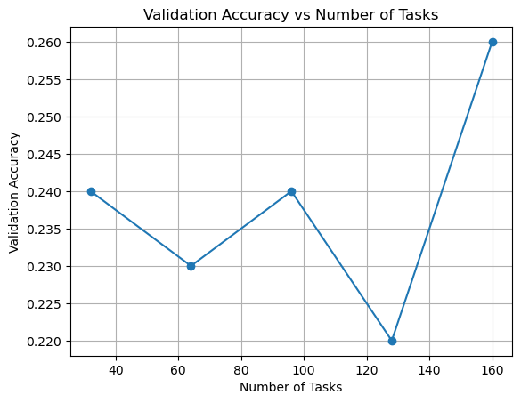
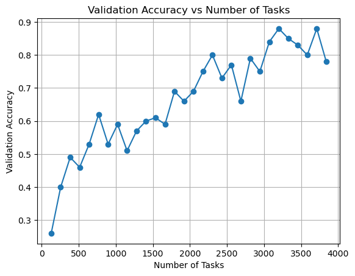
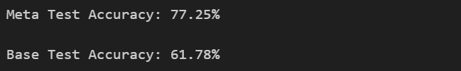

# 实验七 迁移学习和元学习

## 1. 绘制验证集准确率和任务数量的关系图

Base：

Meta：


## 2. 一句话描述验证集准确率和任务数量的关系

- Base：随着任务数量的增加，验证集准确率先下降后上升，呈现出波动的趋势。

- Meta：随着任务数量的增加，验证集准确率整体呈上升趋势，尽管中间有波动，但最终趋于稳定。

## 3. 阅读[论文](https://arxiv.org/abs/1810.09502)并写出一个使用 MAML 时可能出现的问题

**训练不稳定**。MAML 在训练过程中可能会出现不稳定的情况，尤其是在某些神经网络架构和超参数设置下。这种不稳定性表现为训练过程中的梯度爆炸或梯度消失问题，导致模型无法收敛或收敛到次优解。

## 4. 解释上一问的问题为什么会出现并给出你的解决方法

MAML 的外循环优化需要通过展开的内循环网络进行反向传播，本身可能会导致梯度问题；此外，标准的 4 层卷积网络缺乏跳跃连接，使得梯度在多次传递中被相同参数多次乘积，进一步加剧了梯度问题。

解决方法：使用 **`torch.nn.utils.clip_grad_norm_()`** 对梯度裁剪。

```python
if train:
        """ Outer Loop Update """
        meta_batch_loss.backward()
        # 梯度裁剪以解决训练不稳定导致的梯度爆炸或梯度消失
        torch.nn.utils.clip_grad_norm_(model.parameters(), max_norm=5.0)
        optimizer.step()
```

## 5. 描述你对源代码做了哪些改进以提高测试准确率

### 1. 数据增强

- Omniglot 是字符识别，非常适合做旋转、缩放、翻转等增强。
- 修改 `transform`：

```python
self.transform = transforms.Compose([     transforms.RandomRotation(15),     transforms.ToTensor() ])
```

### 2. 调整训练参数

- 增加 `inner_train_step`：测试时是 10 步，但训练时只有 1 步（`train_inner_train_step = 1`），容易造成训练与测试过程不一致。
- 尝试更小的 `inner_lr`：初始设为 0.4，此较大的学习率可能会导致训练不稳定，尤其是在 `MAML` 中需要多步反向传播。

```python
n_way = 5
k_shot = 1
q_query = 1
train_inner_train_step = 3 # base 1
val_inner_train_step = 3
inner_lr = 0.05 # base 0.4
meta_lr = 0.001
meta_batch_size = 32
max_epoch = 30
eval_batches = 20
train_data_path = "./Omniglot/images_background/"
```

### 3. 微调优化器

- 初始为 Adam + `lr=0.001`，换为 SGD + momentum。

```python
def model_init():
    meta_model = Classifier(1, n_way).to(device)
    # optimizer = torch.optim.Adam(meta_model.parameters(), lr=meta_lr)
    optimizer = torch.optim.SGD(meta_model.parameters(), lr=meta_lr, momentum=0.9)
    loss_fn = nn.CrossEntropyLoss().to(device)
    return meta_model, optimizer, loss_fn
```

## 6. 实验结果


