# 实验八 多模态情感分析（Multimodal Sentiment Analysis）

## 任务一：补全代码

### 数据集加载

```python
class MOSIDataset(Dataset):
    def __init__(self, data_path, split='train'):
        # Load the data from the pickle file
        with open(data_path, 'rb') as f:
            data = pickle.load(f)

        # Select the appropriate split
        self.vision = data[split]['vision']
        self.text = data[split]['text']
        self.audio = data[split]['audio']
        self.labels = data[split]['labels']
        self.ids = data[split]['id']

        # audio数据中存在坏点需要处理：
        self.audio[self.audio == float('inf')] = 0.0
        self.audio[self.audio == float('-inf')] = 0.0

    def __len__(self):
        # add: 返回数据集长度
        return len(self.labels)

    def __getitem__(self, idx):
        # Extract the features and label for the given index
        vision = torch.tensor(self.vision[idx], dtype=torch.float32)
        text = torch.tensor(self.text[idx], dtype=torch.float32)
        audio = torch.tensor(self.audio[idx], dtype=torch.float32)
        label = torch.tensor(self.labels[idx], dtype=torch.float32).squeeze()

        return vision, text, audio, label
```

### 模型构建

```python
class MultimodalSentimentAnalysisModel(nn.Module):
    def __init__(self):
        super(MultimodalSentimentAnalysisModel, self).__init__()

        self.vision_norm = nn.LayerNorm(35)
        self.text_norm = nn.LayerNorm(300)
        self.audio_norm = nn.LayerNorm(74)

        self.vision_fc = nn.Linear(35, 128)
        self.text_fc = nn.Linear(300, 128)
        self.audio_fc = nn.Linear(74, 128)

        # 定义vision_lstm, text_lstm 和 audio_lstm和融合层mm_lstm. 要求hidden_size=128, num_layers=1, dropout=0.1, batch_first=True
        # add
        self.vision_lstm = nn.LSTM(input_size=128, hidden_size=128, num_layers=1, dropout=0.1, batch_first=True)
        self.text_lstm = nn.LSTM(input_size=128, hidden_size=128, num_layers=1, dropout=0.1, batch_first=True)
        self.audio_lstm = nn.LSTM(input_size=128, hidden_size=128, num_layers=1, dropout=0.1, batch_first=True)
        self.mm_lstm = nn.LSTM(input_size=128, hidden_size=128, num_layers=1, dropout=0.1, batch_first=True)

        # Define a fully connected layer for fusion
        self.fc = nn.Linear(128, 1)

    def forward(self, vision, text, audio):

        # apply layernorm
        # add
        vision = self.vision_norm(vision)
        text = self.text_norm(text)
        audio = self.audio_norm(audio)

        # Process each modality
        vision = F.relu(self.vision_fc(vision))
        text = F.relu(self.text_fc(text))
        audio = F.relu(self.audio_fc(audio))

        # LSTM for temporal processing
        output_v, (vision_h, _) = self.vision_lstm(vision)
        output_t, (text_h, _) = self.text_lstm(text)
        output_a, (audio_h, _) = self.audio_lstm(audio)

        # 对单模态的LSTM输出进行直接相加得到feature
        # add: feature
        feature = (vision_h[-1] + text_h[-1] + audio_h[-1]).unsqueeze(1)
        _, (fusion_tensor, _) = self.mm_lstm(feature)

        # Concatenate the final hidden states
        output = self.fc(fusion_tensor[-1])

        # Apply sigmoid to constrain output to (0, 1)
        output = torch.sigmoid(output)
        # Scale and shift to range (-3, 3)
        output = output * 6 - 3

        return output
```

### 评价指标

```python
def multiclass_acc(y_pred, y_true):
    y_pred = np.round(y_pred)
    y_true = np.round(y_true)

    # Compute the accuracy
    # 注意，这里统计的是总的分类准确率，而不是在每个类别上的准确率。
    acc = (y_pred == y_true).sum() / len(y_true)

    return acc
```

### 模型训练

```python
def train_model(model, train_loader, valid_loader, criterion, optimizer, scheduler, device, epochs):
    model.to(device)

    best_corr = 0.
    best_epoch = 0

    for epoch in range(epochs):
        model.train()
        running_loss = 0.0

        for i, (vision, text, audio, labels) in enumerate(train_loader):
            vision, text, audio, labels = vision.to(device), text.to(device), audio.to(device), labels.to(device)

            optimizer.zero_grad()

            # add 模型前向获得输出：
            outputs = model(vision, text, audio)
            # add 计算损失：
            loss = criterion(outputs.view(-1), labels.view(-1))
            # add 反向传播，计算梯度
            loss.backward()

            optimizer.step()
            scheduler.step()

            running_loss += loss.item()

        print(f'Epoch [{epoch+1}/{epochs}], Loss: {running_loss/len(train_loader):.4f}')

        val_corr = validate_model(model, valid_loader, criterion, device)

        if val_corr > best_corr:
            best_corr = val_corr
            best_epoch = epoch
            torch.save(model.state_dict(), 'best_model.pth')

    print(f"Best model saved with val_corr {best_corr} at epoch {best_epoch}.")

```

### 模型验证

```python
def validate_model(model, valid_loader, criterion, device):
    model.eval()
    valid_loss = 0.0

    all_preds = []
    all_labels = []

    with torch.no_grad():
        for vision, text, audio, labels in valid_loader:
            vision, text, audio, labels = vision.to(device), text.to(device), audio.to(device), labels.to(device)

            outputs = model(vision, text, audio)
            loss = criterion(outputs.squeeze(), labels.squeeze())

            valid_loss += loss.item()

            all_preds.append(outputs)
            all_labels.append(labels)

    print(f'Validation Loss: {valid_loss/len(valid_loader):.4f}')

    all_preds = torch.cat(all_preds, dim=0)
    all_labels = torch.cat(all_labels, dim=0)

    # add 计算评价指标
    eval_results = eval_mosi_regression(all_preds, all_labels)
    print(eval_results)

    return eval_results["Corr"]
```

### 主函数

```python
def main():

    # 固定随机数种子，确保实验结果可重复性
    seed = 42
    random.seed(seed)
    np.random.seed(seed)
    torch.manual_seed(seed)
    if torch.cuda.is_available():
        torch.cuda.manual_seed(seed)
        torch.cuda.manual_seed_all(seed)

    device = torch.device('cuda:0' if torch.cuda.is_available() else 'cpu')
    print(device)

    # add 定义损失函数criterion, 使用均方误差损失。可以使用pytorch封装好的函数，也可以根据公式手写：
    criterion = nn.MSELoss()

    learning_rate = 1e-3
    epochs = 20

    # add: Initialize the model.
    model = MultimodalSentimentAnalysisModel()

    data_path = './mosi_raw.pkl'
    # add 初始化训练集和验证集的数据集类
    train_dataset = MOSIDataset(data_path, split='train')
    valid_dataset = MOSIDataset(data_path, split='valid')
    # add 初始化训练集和验证集的加载器，要求batch_size=16
    train_loader = DataLoader(train_dataset, batch_size=16, shuffle=True)
    valid_loader = DataLoader(valid_dataset, batch_size=16, shuffle=False)

    # Initialize the optimizer and scheduler.
    # add: 使用Adam优化器
    optimizer = torch.optim.Adam(model.parameters(), lr=learning_rate)
    scheduler = CosineAnnealingLR(optimizer, T_max=epochs*len(train_loader))

    # add 调用训练函数，注意传入对应参数：
    train_model(model, train_loader, valid_loader, criterion, optimizer, scheduler, device, epochs)

    # 加载最佳epoch参数
    best_model_state = torch.load('best_model.pth')
    model.load_state_dict(best_model_state)

    # 初始化测试集的数据集类和加载器
    test_dataset = MOSIDataset(data_path, split='test')
    test_loader = DataLoader(test_dataset, batch_size=16, shuffle=False)

    print("\n========== test results: ==========\n")
    validate_model(model, test_loader, criterion, device)
```

### 程序执行

```python
if __name__ == "__main__":
    main()
```

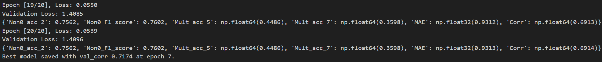

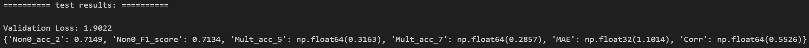

## 任务二：实验结果对比分析、消融实验和新模型设计

### 思考题 1

**在上述代码的基础上，使用 tensorboard 记录训练过程在训练集和验证集上的损失变化曲线，分析损失变化趋势不同的原因。使用 tensorboard 输出模型结构图。**

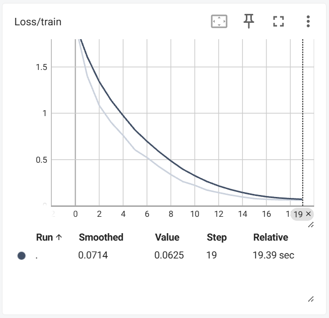
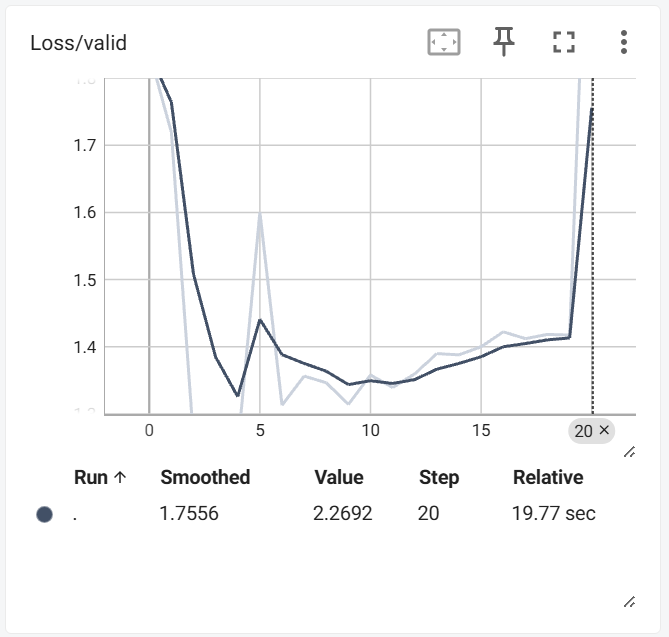

原因分析：

1. 过拟合：训练集损失持续下降，而验证集损失在后期上升，表明模型在训练集上表现良好，但在验证集上表现变差。这通常是过拟合的迹象，即模型在训练集上学习到了噪声和细节，而这些在验证集上并不适用。
2. 数据分布差异：如果验证集包含的数据特征与训练集不同，模型在验证集上的表现可能会较差，从而导致验证集损失波动较大。
3. 模型复杂度：复杂的模型更容易捕捉到训练数据中的噪声，从而在验证集上过拟合。

模型结构图：

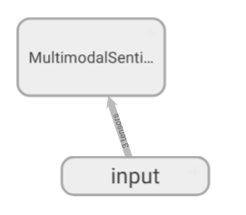

### 思考题 2：消融实验分析

#### 2.1

**在原模型的基础上，使用 Transformer encoder 替换上述模型中的 LSTM，记录并分析实验结果。可以使用 pytorch 封装好的模型，也可以自己手写 Transformer。由于处理的对象是时序数据，因此不要忘记使用位置编码（position encoding）。**

关键修改：

```python
class PositionalEncoding(nn.Module):
    def __init__(self, d_model, max_len=500):
        super(PositionalEncoding, self).__init__()
        pe = torch.zeros(max_len, d_model)
        position = torch.arange(0, max_len).unsqueeze(1).float()
        div_term = torch.exp(torch.arange(0, d_model, 2).float() * (-np.log(10000.0) / d_model))
        pe[:, 0::2] = torch.sin(position * div_term)
        pe[:, 1::2] = torch.cos(position * div_term)
        pe = pe.unsqueeze(0)
        self.register_buffer('pe', pe)

    def forward(self, x):
        x = x + self.pe[:, :x.size(1)]
        return x

class MultimodalSentimentAnalysisTransformerModel(nn.Module):
    def __init__(self):
        super().__init__()
        self.hidden_dim = 128
        self.num_layers = 1
        self.num_heads = 4

        self.vision_norm = nn.LayerNorm(35)
        self.text_norm = nn.LayerNorm(300)
        self.audio_norm = nn.LayerNorm(74)

        self.vision_fc = nn.Linear(35, self.hidden_dim)
        self.text_fc = nn.Linear(300, self.hidden_dim)
        self.audio_fc = nn.Linear(74, self.hidden_dim)

        self.pe = PositionalEncoding(self.hidden_dim)

        encoder_layer = nn.TransformerEncoderLayer(d_model=self.hidden_dim, nhead=self.num_heads, dim_feedforward=256, dropout=0.1, batch_first=True)
        self.vision_transformer = nn.TransformerEncoder(encoder_layer, num_layers=self.num_layers)
        self.text_transformer = nn.TransformerEncoder(encoder_layer, num_layers=self.num_layers)
        self.audio_transformer = nn.TransformerEncoder(encoder_layer, num_layers=self.num_layers)
        self.mm_transformer = nn.TransformerEncoder(encoder_layer, num_layers=self.num_layers)

        self.fc = nn.Linear(self.hidden_dim, 1)

    def forward(self, vision, text, audio):
        vision = self.vision_norm(vision)
        text = self.text_norm(text)
        audio = self.audio_norm(audio)

        vision = self.pe(F.relu(self.vision_fc(vision)))
        text = self.pe(F.relu(self.text_fc(text)))
        audio = self.pe(F.relu(self.audio_fc(audio)))

        vision_feat = self.vision_transformer(vision).mean(dim=1)
        text_feat = self.text_transformer(text).mean(dim=1)
        audio_feat = self.audio_transformer(audio).mean(dim=1)

        fused = vision_feat + text_feat + audio_feat
        fused = fused.unsqueeze(1)

        fusion_tensor = self.mm_transformer(fused).squeeze(1)

        output = self.fc(fusion_tensor)
        output = torch.sigmoid(output)
        output = output * 6 - 3
        return output

```

实验结果：

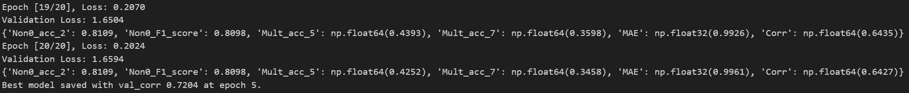


分析：

Transformer 相比较原始 LSTM 在多个方面有提升。

- Transformer 在验证集上的最佳相关系数高于 LSTM，为 0.7204，说明模型在学习情感强度的趋势方面有更强的能力。
- MAE 最低达到 0.8778，说明预测误差更小。
- Transformer 的 `Non0_acc_2` 和 `Non0_F1_score` 均超过 LSTM。
- Transformer 的 `Mult_acc_5` 和 `Mult_acc_7` 整体高于 LSTM，尤其是在前几轮训练中进步明显。

#### 2.2

**模型中使用 Layernorm 的目的是什么？对比原模型和移除 Layernorm 层以后的实验结果差异。**

使用 Layernorm 的目的：

1. 加速收敛：LayerNorm 对每个样本的特征进行标准化，缓解了梯度消失/爆炸的问题，使训练更稳定。
2. 提高模型泛化能力：通过统一特征分布，模型更容易学习到对不同输入具有鲁棒性的表示，从而提升验证集和测试集上的性能。

移除 Layernorm 层以后的实验结果：

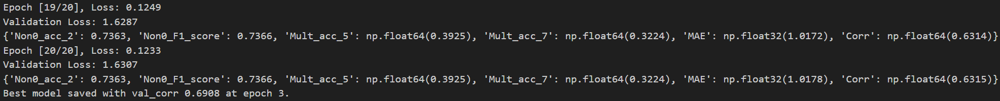

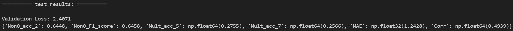

差异对比：

移除 LayerNorm 后，模型的表现明显变差，说明 LayerNorm 在模型收敛性、鲁棒性以及表达能力上有重要作用，是稳定训练和提升性能的关键要素之一。

#### 2.3

**在原模型的基础上移除对应模块，对比只使用 text 输入，只使用 vision 输入，只使用 audio 输入，和使用 text+vision 输入，使用 text+audio 输入和使用全部模态输入的实验结果差别，并分析实验结果。**

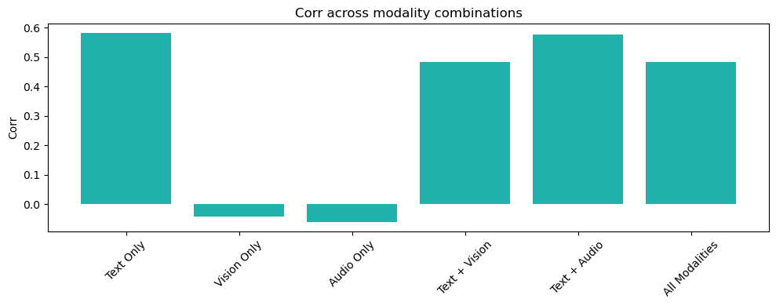
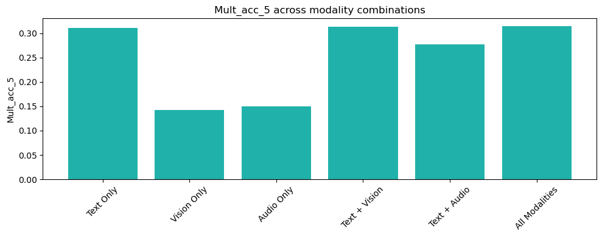
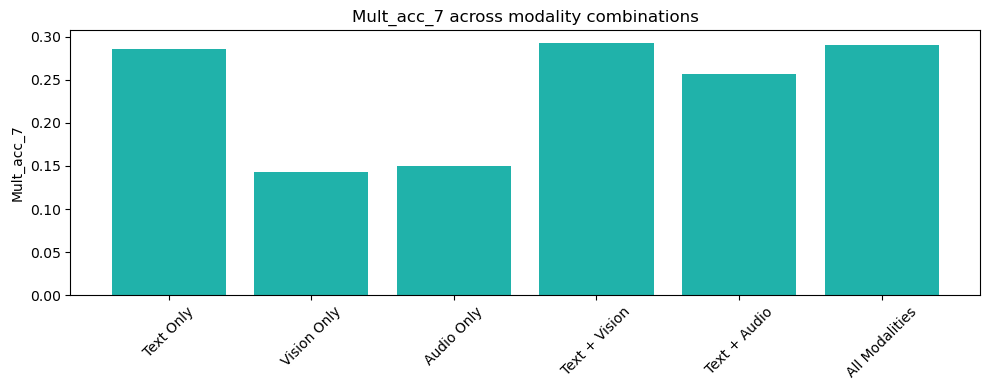
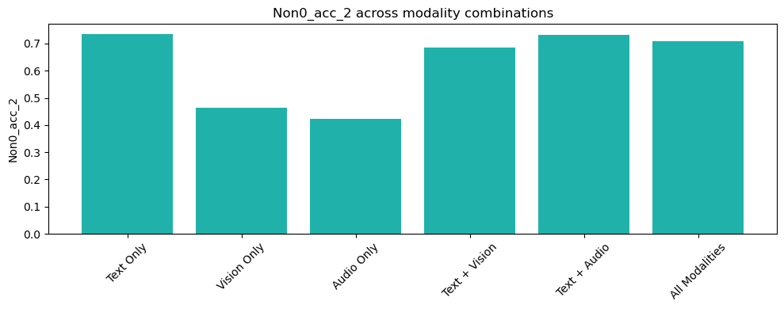
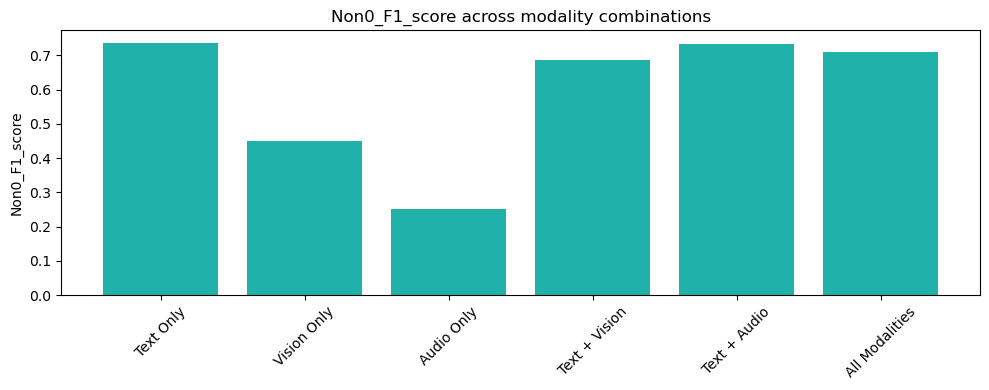

- Text Only 效果最佳，说明文本信息在情感识别中最具代表性。
- Vision Only 和 Audio Only 表现较差，`Corr` 接近 0 或为负，`F1` 最低，表明它们单独难以捕捉有效情感信号。
- 多模态融合在一定程度上提升了效果：
  - Text + Audio 组合接近文本单模态，`F1` 略低于纯文本；
  - Text + Vision 表现略逊于 Text + Audio；
  - 全部模态反而没有超过 Text + Audio，可能是由于冗余或模态冲突影响模型学习。

**结论**：文本是最有效的单模态，适当融合音频信息能进一步提升性能，但视觉模态单独或三模态融合效果不一定更好，说明多模态融合需谨慎设计结构与对齐策略。

#### 2.4

**在原模型的基础上，将损失函数从均方误差损失（Mean Square Error）替换成绝对误差损失（Mean Absolute Error， MAE）和平滑 L1 损失（Huber Loss），对比实验结果差异。**

绝对误差损失（Mean Absolute Error， MAE）：

```python
criterion = nn.L1Loss()
```

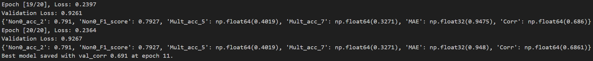

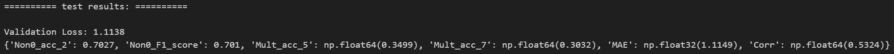

平滑 L1 损失（Huber Loss）：

```python
criterion = nn.SmoothL1Loss()
```

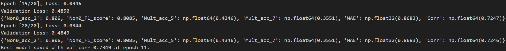

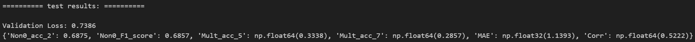

从实验结果可以看出，不同损失函数对模型在多模态情感分析任务中的表现产生了明显影响。使用均方误差损失（MSE）时模型在相关系数和情感分类准确率上表现最好，但其 MAE 相对较高，表明对极端值更敏感。使用绝对误差损失（MAE）时模型在 MAE 和多分类准确率上表现更好，说明其鲁棒性更强，更适合不关注极端误差的场景。而 Huber Loss 则在验证损失上最低，显示其在训练过程中更稳定，但最终 MAE 和相关系数略逊于其他方法。综合来看，MSE 更适合追求相关性和分类准确率的任务，而 MAE 更平衡，Huber 更稳定但预测精度略低。

#### 2.5

**在原模型的基础上，将特征融合方式从简单相加+LSTM 替换成基于注意力机制（参考实验五）的融合方式。例如，你可以通过对于不同模态的特征相加或拼接和进行 self-attention, 或者在不同模态之间进行 cross-attention。在实验报告中描述你的方案并记录实验结果。**

关键修改：

```python
# 原始 LSTM 输出
_, (vision_h, _) = self.vision_lstm(vision)
_, (text_h, _) = self.text_lstm(text)
_, (audio_h, _) = self.audio_lstm(audio)

# 拼接模态 hidden state
modality_features = torch.stack([vision_h[-1], text_h[-1], audio_h[-1]], dim=1)  # (B, 3, 128)

# Attention 融合
attn_output, _ = self.attn(modality_features, modality_features, modality_features)
fusion_feature = attn_output.mean(dim=1)  # (B, 128)

# 全连接预测输出
output = self.fc(fusion_feature)
output = torch.sigmoid(output) * 6 - 3
return output
```

将原模型中对三模态特征的简单相加方式替换为基于自注意力机制的融合方法。将各模态的 LSTM 最终状态拼接后输入到 `MultiheadAttention` 模块中，建模模态间的关联性，增强跨模态信息交互能力。融合后得到的特征进一步用于预测情感得分。实验结果如下：

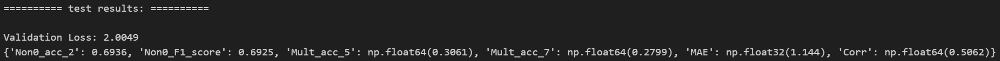

### 思考题 3

**结合上述分析，设计一个相比于原模型表现更好的多模态情感分析模型。你可以通过替换单模态编码模型、损失函数、多模态融合方式，或者综合几种方法来获得更好的性能表现。在报告中结合图示或者公式详细描述你的模型设计，指出你的模型相比原模型的改进之处，并和原模型进行实验结果对比。请将模型代码包含在 EXP_MSA.ipynb 文件或者提交新的 ipynb 文件。**

改进：

1. 编码器替换：使用 Transformer Encoder 替代 LSTM

```python
class TransformerEncoderBlock(nn.Module):
    def __init__(self, input_dim, d_model=128, nhead=4, num_layers=2, dropout=0.1):
        super().__init__()
        encoder_layer = nn.TransformerEncoderLayer(d_model=d_model, nhead=nhead, dim_feedforward=256, dropout=dropout, batch_first=True)
        self.encoder = nn.TransformerEncoder(encoder_layer, num_layers=num_layers)
        self.project = nn.Linear(input_dim, d_model)
        self.norm = nn.LayerNorm(input_dim)

    def forward(self, x):
        x = self.norm(x)
        x = F.relu(self.project(x))
        x = self.encoder(x)
        return x  # (batch, seq, d_model)
```

2. 多模态融合方式：引入注意力机制，使用注意力融合替代简单的加和操作，通过可学习的 Query 向量与三个模态交互。

```python
class AttentionFusion(nn.Module):
    def __init__(self, d_model=128):
        super().__init__()
        self.query = nn.Parameter(torch.randn(1, 1, d_model))  # Learnable query vector
        self.attn = nn.MultiheadAttention(d_model, num_heads=4, batch_first=True)

    def forward(self, v, t, a):
        # Concatenate: (B, 3, D)
        x = torch.stack([v[:, -1], t[:, -1], a[:, -1]], dim=1)
        q = self.query.expand(x.size(0), -1, -1)  # (B, 1, D)
        fused, _ = self.attn(q, x, x)
        return fused.squeeze(1)
```

3. 损失函数：Huber Loss 替代 MSE。Huber Loss 对异常值更鲁棒，拟合情感连续值时效果更稳健。

```python
criterion = nn.SmoothL1Loss()  # Huber Loss
```

实验结果：

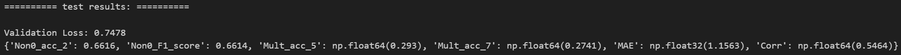

改进模型的验证损失下降明显，表明其拟合能力更强，优化更稳定。同时，改进模型在表达能力和融合机制上具有明显优势，具备进一步优化潜力。

## 实验心得与体会

本次多模态情感分析实验中，我在保留原有整体架构的基础上，引入了 Transformer 编码器和注意力机制进行模型改进，尝试提升对模态间复杂依赖关系的建模能力。通过实验对比，虽然改进模型在验证损失上取得了显著下降，显示出更强的拟合与表达能力，但在多项评估指标（如 MAE、F1、相关系数等）上略有下降，提示模型尚需更长时间训练或更精细的超参数调优。此次实验让我深刻体会到模型结构创新的重要性，同时也认识到性能提升不仅依赖模型复杂度，还需兼顾训练稳定性与数据分布的适应性，为后续多模态建模积累了宝贵的经验。
