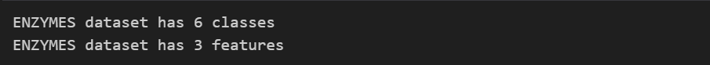
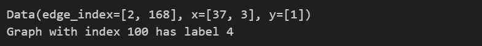
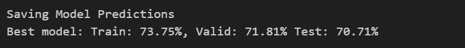
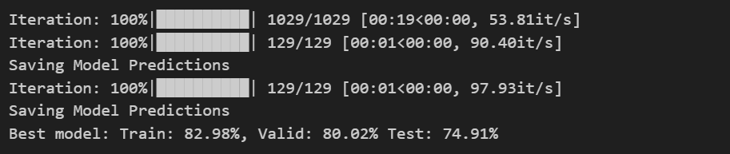

# 实验九 图卷积神经网络（GCN）

## 任务一：PyG (数据集和数据)

### Question1: ENZYMES 数据集中有多少类，多少特征

```python
def get_num_classes(pyg_dataset):
  num_classes = pyg_dataset.num_classes
  return num_classes

def get_num_features(pyg_dataset):
  num_features = pyg_dataset.num_features
  return num_features
```



### Question 2： ENZYMES 数据集中 index 为 100 的图的 label 是什么？

```python
def get_graph_class(pyg_dataset, idx):
  label = pyg_dataset[idx].y.item()
  return label
```



### Question 3：index 为 200 的图有多少条边？

```python
def get_graph_num_edges(pyg_dataset, idx):

  data = pyg_dataset[idx]        
  edge_index = data.edge_index    
  num_edges = edge_index.size(1) // 2
 
  return num_edges
```


## 任务二：Open Graph Benchmark(OGB)

### Question 4: ogbn-arxiv 的图中有多少特征？

```python
def graph_num_features(data):
  num_features = data.x.size(1)
  return num_features
```


## 任务三：GNN：节点属性预测

### GCN 模型

```python
class GCN(torch.nn.Module):
    def __init__(self, input_dim, hidden_dim, output_dim, num_layers,
                 dropout, return_embeds=False):
        super(GCN, self).__init__()
        self.convs = torch.nn.ModuleList()
        self.bns = torch.nn.ModuleList()
        self.softmax = torch.nn.LogSoftmax(dim=1)

        self.convs.append(GCNConv(input_dim, hidden_dim))

        for _ in range(num_layers - 2):
            self.convs.append(GCNConv(hidden_dim, hidden_dim))

        self.convs.append(GCNConv(hidden_dim, output_dim))

        for _ in range(num_layers - 1):
            self.bns.append(torch.nn.BatchNorm1d(hidden_dim))

        # 元素被置为 0 的概率（Dropout 概率）
        self.dropout = dropout

        # 是否跳过分类层并返回节点嵌入
        self.return_embeds = return_embeds

    def reset_parameters(self):
        for conv in self.convs:
            conv.reset_parameters()
        for bn in self.bns:
            bn.reset_parameters()

    def forward(self, x, adj_t):

        for i, conv in enumerate(self.convs[:-1]):  # 除了最后一层
            x = conv(x, adj_t)
            x = self.bns[i](x)
            x = F.relu(x)
            x = F.dropout(x, p=self.dropout, training=self.training)
        x = self.convs[-1](x, adj_t)  # 最后一层

        if self.return_embeds:
            return x  # 不做 softmax，直接返回嵌入
        else:
            return self.softmax(x)
```

```python
def train(model, data, train_idx, optimizer, loss_fn):
    # TODO: 实现一个使用给定的优化器和损失函数训练模型的函数。
    model.train()
    loss = 0

    optimizer.zero_grad()
    out = model(data.x, data.adj_t)
    loss = loss_fn(out[train_idx], data.y[train_idx].squeeze())

    loss.backward()
    optimizer.step()

    return loss.item()

```

```python
# 测试函数
@torch.no_grad()
def test(model, data, split_idx, evaluator, save_model_results=False):
    # TODO: 实现一个使用给定的 split_idx 和 evaluator 来测试模型的函数。
    model.eval()

    # 模型在所有数据上的输出
    out = model(data.x, data.adj_t)

    y_pred = out.argmax(dim=-1, keepdim=True)

    train_acc = evaluator.eval({
        'y_true': data.y[split_idx['train']],
        'y_pred': y_pred[split_idx['train']],
    })['acc']
    valid_acc = evaluator.eval({
        'y_true': data.y[split_idx['valid']],
        'y_pred': y_pred[split_idx['valid']],
    })['acc']
    test_acc = evaluator.eval({
        'y_true': data.y[split_idx['test']],
        'y_pred': y_pred[split_idx['test']],
    })['acc']

    if save_model_results:
      print ("Saving Model Predictions")

      data = {}
      data['y_pred'] = y_pred.view(-1).cpu().detach().numpy()

      df = pd.DataFrame(data=data)
      # 本地保存为 CSV 文件
      df.to_csv('ogbn-arxiv_node.csv', sep=',', index=False)

    return train_acc, valid_acc, test_acc
```

### Question 5 ：你的**最佳模型**验证集和测试集精度如何？



## 任务四：GNN：图性质预测

```python
from ogb.graphproppred.mol_encoder import AtomEncoder
from torch_geometric.nn import global_add_pool, global_mean_pool

### GCN 用于预测图属性
class GCN_Graph(torch.nn.Module):
    def __init__(self, hidden_dim, output_dim, num_layers, dropout):
        super(GCN_Graph, self).__init__()

        # 加载分子图中原子的编码器
        self.node_encoder = AtomEncoder(hidden_dim)

        # 节点嵌入模型
        # 注意：输入维度和输出维度都设置为 hidden_dim
        self.gnn_node = GCN(hidden_dim, hidden_dim,
            hidden_dim, num_layers, dropout, return_embeds=True)

        self.pool = global_mean_pool

        # 输出层
        self.linear = torch.nn.Linear(hidden_dim, output_dim)


    def reset_parameters(self):
      self.gnn_node.reset_parameters()
      self.linear.reset_parameters()

    def forward(self, batched_data):
        x = self.node_encoder(batched_data.x)
        node_embeddings = self.gnn_node(x, batched_data.edge_index)
        graph_embeddings = self.pool(node_embeddings, batched_data.batch)
        out = self.linear(graph_embeddings)

        return out
```

```python
def train(model, device, data_loader, optimizer, loss_fn):
    # TODO: 实现一个使用给定优化器和损失函数训练模型的函数。
    model.train()
    loss = 0

    for step, batch in enumerate(tqdm(data_loader, desc="Iteration")):
      batch = batch.to(device)

      if batch.x.shape[0] == 1 or batch.batch[-1] == 0:
          continue
      else:
        ## 在计算训练损失时忽略包含 nan 的目标（未标注样本）
        is_labeled = batch.y == batch.y

        optimizer.zero_grad()
        out = model(batch)
        labeled_out = out[is_labeled]
        labeled_y = batch.y[is_labeled].float()
        loss = loss_fn(labeled_out, labeled_y)

        loss.backward()
        optimizer.step()

    return loss.item()
```

### Quesion 6： 你的最佳模型的验证/测试 ROC-AUC 分数多少？



## 实验心得与体会

本次实验主要围绕图神经网络（GCN）的实现与应用展开，涉及节点分类任务（如 `ogbn-arxiv` 数据集）和图分类任务（如分子图预测）。通过从零开始手动搭建模型模块、训练与测试流程，我对图神经网络的内部机制有了更深刻的理解。

在节点分类任务中，我首先实现了标准的 GCN 模型，包括多层 GCNConv、BatchNorm1d 和 LogSoftmax 结构。在构建 `forward` 函数时，我意识到节点特征在图卷积和批归一化后的非线性激活与 Dropout，对于防止过拟合、加速收敛具有重要作用。训练过程中遇到的两个典型错误也加深了我的印象：一是 GCNConv 需要正确处理邻接矩阵的数据类型（如 `SparseTensor`）；二是损失函数（如 `nll_loss`）要求目标标签必须是一维向量，不能直接传入 one-hot 或二维张量。这些小细节对保证模型稳定训练非常关键。

在图分类任务中，我构建了一个新的 GCN_Graph 模型，使用了 AtomEncoder 将节点（原子）特征进行预编码，再通过 GCN 层提取节点嵌入，并结合全局平均池化（`global_mean_pool`）将节点级别的特征汇聚到图级别，最终通过线性层进行图属性预测。训练函数中我特别注意了缺失标签（nan 标签）的处理，仅在标注完整的数据上计算损失，从而有效避免了无监督样本对梯度的干扰。这一细节提升了模型在分子图任务中的表现和收敛速度。

虽然 PyG（PyTorch Geometric）提供了高层接口，简化了 GNN 的开发，但理解每一层的细节仍然至关重要。比如 BatchNorm 的插入位置、Dropout 的使用方式、池化层的选择，以及训练时的掩码处理等，都会对模型性能产生显著影响。此外，debug 过程中遇到的一些报错也让我学会了如何根据错误信息定位问题，比如张量维度不匹配、数据类型不正确等。
